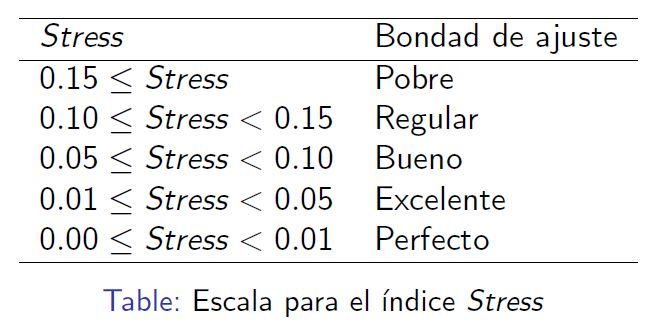
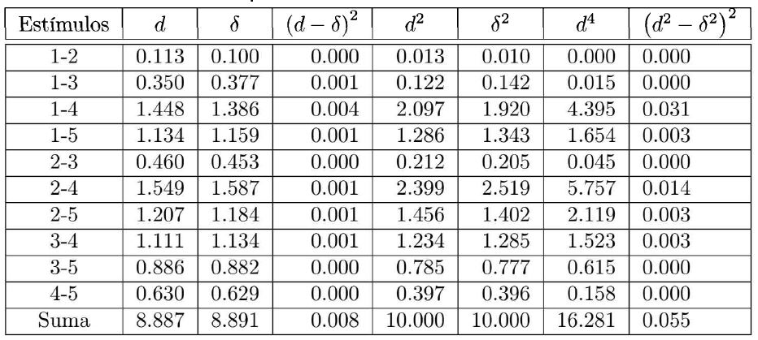
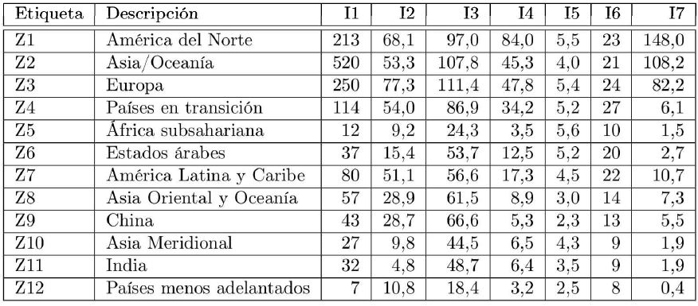
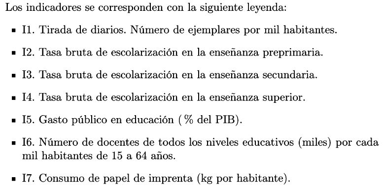

```{r setup, include=FALSE}
knitr::opts_chunk$set(echo = TRUE)
```

## Introducción

<div align="justify">
El análisis de escalamiento multidimensional (MDS) es una <span style="color:blue"> técnica de reducción de datos </span> como otras que hemos visto anteriormente: análisis factorial o análisis de componentes principales, por ejemplo. 
El <span style="color:red"> objetivo principal </span> del MDS es <span style="color:blue">representar $N$ objetos en un espacio dimensional reducido ($q$ dimensiones, siendo $q < N$) </span>, de tal forma que la <span style="color:green"> distorsión causada por la reducción de la dimensionalidad sea la menor posible </span>, es decir, que las distancias entre los objetos representados en el espacio $q$ dimensional sean lo más parecidas posible a las distancias en el espacio $N$ dimensional.
</div>

## Introducción

<div align="justify">
Dado que será <span style="color:blue"> difícil que las distancias coincidan</span>, el objetivo del MDS es <span style="color:green">conseguir que ambas configuraciones dimensionales sean lo más parecidas posible</span>, Para ello será necesario construir un <span style="color:brown">indicador de esa proximidad </span> que, como se detallará más adelante, denominaremos <span style="color:brown">stress o sstress</span>.
</div>

## Valoración de la imagen de superficies comerciales 

<div id="left">

```
datos <- matrix(c(
0.0, 1.0, 2.1, 6.1, 5.2,
1.0, 0.0, 2.4, 6.9, 5.3,
2.1, 2.4, 0.0, 5.1, 4.1,
6.1, 6.9, 5.1, 0.0, 3.1,
5.2, 5.3, 4.1, 3.1,0.0), ncol=5, nrow=5, byrow=T,
dimnames=list(c("X1","X2","X3","X4","X5")))
datos
```

```{r echo=FALSE, warning=FALSE, message=FALSE}
datos <- matrix(c(
0.0, 1.0, 2.1, 6.1, 5.2,
1.0, 0.0, 2.4, 6.9, 5.3,
2.1, 2.4, 0.0, 5.1, 4.1,
6.1, 6.9, 5.1, 0.0, 3.1,
5.2, 5.3, 4.1, 3.1,0.0), ncol=5, nrow=5, byrow=T,
dimnames=list(c("X1","X2","X3","X4","X5")))
datos
```

</div>
<div id="right">
 <div align="justify">
  <font size="6">
   <p class="small">
Supongamos que hemos pedido a <span style="color:blue">100 consumidores</span> que valoren la <span style="color:blue">imagen que tienen de 5 superficies comerciales</span>, atendiendo a la similitud con que las perciben. Para ello se utiliza una <span style="color:green">escala de 0 (idénticas) a 7 (totalmente diferentes)</span>. <br>
La siguiente <span style="color:brown">matriz de disparidades originales o proximidades</span> nos muestra las <span style="color:brown">medias de las puntuaciones</span> ofrecidas por los 100 consumidores. <br>
</p>
</font>
</div> 
</div>

## Valoración de la imagen de superficies comerciales 

<div id="left">

```
datos <- matrix(c(
0.0, 1.0, 2.1, 6.1, 5.2,
1.0, 0.0, 2.4, 6.9, 5.3,
2.1, 2.4, 0.0, 5.1, 4.1,
6.1, 6.9, 5.1, 0.0, 3.1,
5.2, 5.3, 4.1, 3.1,0.0), ncol=5, nrow=5, byrow=T,
dimnames=list(c("X1","X2","X3","X4","X5")))
datos
```

```{r echo=FALSE, warning=FALSE, message=FALSE}
datos <- matrix(c(
0.0, 1.0, 2.1, 6.1, 5.2,
1.0, 0.0, 2.4, 6.9, 5.3,
2.1, 2.4, 0.0, 5.1, 4.1,
6.1, 6.9, 5.1, 0.0, 3.1,
5.2, 5.3, 4.1, 3.1,0.0), ncol=5, nrow=5, byrow=T,
dimnames=list(c("X1","X2","X3","X4","X5")))
datos
```

</div>
<div id="right">
 <div align="justify">
  <font size="6">
   <p class="small">
Si creamos un <span style="color:blue">mapa en dos dimensiones</span> para ilustrar mejor la percepción de los consumidores, este mapa debería representar como <span style="color:green">puntos cercanos a las superficies $X_1$ y $X_2$</span> porque la <span style="color:green">disparidad</span> entre ellas es<span style="color:green"> pequeña (1.0)</span>, tal y como refleja la matriz. Asimismo, las <span style="color:brown">superficies $X_2$ y $X_4$</span> deberían aparecer representadas muy <span style="color:brown">distantes</span> una de la otra, por cuanto su <span style="color:brown">disparidad</span> en la matriz es <span style="color:brown">elevada (6.9)</span>. 
</p>
</font>
</div> 
</div>

## Valoración de la imagen de superficies comerciales 

<div id="left">

```{r echo=FALSE, warning=FALSE, message=FALSE}
library(smacof)
fit2 <- mds(delta=datos,ndim=2, type="interval")
plot(fit2, main = "Datos de la imagen de cadenas de electrodomésticos")
```

</div>
<div id="right">
```
library(smacof)
fit2 <- mds(delta=datos,ndim=2, type="interval")
plot(fit2, main = "Datos de la imagen de cadenas de electrodomésticos")
```
 <div align="justify">
  <font size="5.8">
   <p class="small">
Se puede apreciar el <span style="color:blue">mapa</span> que se obtiene al <span style="color:blue">representar las coordenadas 
bidimensionales</span> resultantes de aplicar a la matriz anterior uno de los algoritmos que existen para efectuar un MDS, el implementado en `mds(smacof)`. Puede comprobarse como se constata la <span style="color:green">cercanía de $X_1$ y $X_2$</span> y la <span style="color:brown">lejanía de $X_2$ y $X_4$</span> que esperábamos. 
</p>
</font>
</div> 
</div>


## Desarrollo formal de la técnica MSD

<div align="justify">
<font size="6">
   <p class="small">
Con el ejemplo de las superficies comerciales expuesto con anterioridad. Si <span style="color:blue">partimos de $N$ objetos (superficies comerciales)</span>, tendremos entonces <span style="color:blue">$M=N(N—1)/2$ disparidades originales</span> entre pares de objetos (10 en nuestro ejemplo). Asumiendo que no haya empates (los distintos algoritmos resuelven los empates de distintos modos), las <span style="color:green">disparidades</span> pueden escribirse en un <span style="color:green">orden estrictamente ascendente</span>: 
  $$s_{i_1k_1}<s_{i_2k_2}<\ldots<s_{i_Mk_M}$$
donde <span style="color:brown">$s_{i_1k_1}$</span> es la <span style="color:brown">menor de las disparidades</span>. El subíndice $i_1k_1$ indica el <span style="color:brown">par de objetos</span> que son <span style="color:brown">más parecidos</span>. 
</p>
</font>
</div>

## El algoritmo básico del MDS

<div align="justify">
<font size="6">
<p class="small">
En nuestro ejemplo esta ordenación sería la siguiente: 
$$1.0< 2.1< 2.4< 3.1< 4.1< 5.1< 5.2< 5.3< 6.1< 6.9$$
$$s_{12}<s_{13}<s_{23}<s_{45}<s_{35}<s_{34}<s_{15}<s_{25}<s_{14}<s_{24}$$
</p>
<p class="small">
Nuestro <span style="color:blue">objetivo</span> es encontrar una <span style="color:blue">nueva configuración $q$ dimensional</span> de los $N$ objetos (2 dimensiones y 5 objetos en el ejemplo), de tal forma que las <span style="color:brown">distancias calculadas entre ellos en ese espacio $q$ dimensional mantengan la ordenación anterior</span>. En el caso ideal de que se <span style="color:green">mantuviera el orden y las proporciones entre disparidades y distancias</span>, el <span style="color:green">gráfico de dispersión</span> entre ambas se representaría mediante una <span style="color:green">línea recta</span>. 
</p>
</font>
</div>

## El algoritmo básico del MDS

<div id="left">

```
# Solución bidimensional
fit2$conf
```

```{r echo=FALSE, warning=FALSE, message=FALSE}
# Solución bidimensional
fit2$conf
```

</div>
<div id="right">
 <div align="justify">
  <font size="6">
   <p class="small">
En el MDS se van <span style="color:blue">ensayando distintas configuraciones $q$ dimensionales</span> hasta que las <span style="color:blue">distancias en ese espacio y las disparidades originales guarden una relación lo más próxima posible a esta recta ideal</span>. <br>
El código muestra la <span style="color:green">solución bidimensional final</span> resultante de la aplicación del MDS a los datos de nuestro ejemplo. En este cuadro aparecen las <span style="color:green">coordenadas de cada objeto (superficie comercial) en ese espacio bidimensional</span>.
</p>
</font>
</div> 
</div>

## El algoritmo básico del MDS

<div id="left">

```
#Distancias entre las configuraciones
print(fit2$confdist)
```

```{r echo=FALSE, warning=FALSE, message=FALSE}
#Distancias entre las configuraciones
print(fit2$confdist)
```

```{r echo=FALSE, warning=FALSE, message=FALSE}
# Solución bidimensional
fit2$conf
```

</div>
<div id="right">
 <div align="justify">
  <font size="6">
   <p class="small">
A partir de esas <span style="color:blue">coordenadas</span> es sencillo derivar la <span style="color:blue">matriz de distancia entre los distintos 
objetos</span>. Así, tomando <span style="color:green">distancias euclídeas</span>, la distancia entre, por ejemplo, X1 
y X2 tomaría el valor: 
<font size="3.5">
$$d(X_1,X_2)=\sqrt{(-0.5504-(-0.6431))^2+(0.0197-(-0.0451))^2}=0.1131$$
</font>
Repitiendo los cálculos para todos los objetos (estímulos), obtendríamos la 
<span style="color:brown">matriz de distancias $\textbf{D}$ entre las configuraciones</span> mostrada en el código.
</p>
</font>
</div> 
</div>

## El algoritmo básico del MDS

<div id="left">

```
# Matriz de disparidades
print(fit2$dhat)
```

```{r echo=FALSE, warning=FALSE, message=FALSE}
print(fit2$dhat)
```

</div>
<div id="right">
 <div align="justify">
  <font size="6">
   <p class="small">
En el algoritmo del MDS se obtiene, como hemos señalado, una <span style="color:blue">transformación monótona de la matriz de distancias originales en el espacio $N$ dimensional</span> y es respecto a esa <span style="color:blue">transformación (matriz de disparidades $\Delta$)</span> obtenida en <span style="color:green">cada iteración</span> con la que <span style="color:green">se va comparando la matriz  $\textbf{D}$</span>.<br>
El código muestra la <span style="color:brown">solución final bidimensional</span> alcanzada en la <span style="color:brown">última iteración proporciona la matriz de disparidades $\Delta$</span>.
</p>
</font>
</div> 
</div>

## El algoritmo básico del MDS

<div id="left">

```{r echo=FALSE, warning=FALSE, message=FALSE}
plot(fit2,plot.type="Shepard",plot.dim=c(1,2),sphere=TRUE,bubscale=0.1,col=1,
label.conf=list(label=TRUE,pos=3,col=1,cex=0.8),
shepard.x=NULL,identify=FALSE,
type="p",pch=20,asp=1,col.hist=NULL)
```

</div>
<div id="right">

```
plot(fit2,plot.type="Shepard",plot.dim=c(1,2),sphere=TRUE,bubscale=0.1,col=1,
label.conf=list(label=TRUE,pos=3,col=1,cex=0.8),
shepard.x=NULL,identify=FALSE,
type="p",pch=20,asp=1,col.hist=NULL)
```
 <div align="justify">
  <font size="5">
   <p class="small">
Así pues, la <span style="color:blue">matriz de disparidades $\Delta$</span> es simplemente una <span style="color:blue">transformación 
monótona de la matriz de distancias originales $\textbf{S}$</span>. Esto se puede comprobar representando, simplemente, en un <span style="color:green">gráfico de dispersión las distancias que aparecen en ambas</span>. 
Este gráfico es conocido como <span style="color:brown">diagrama de Shepard</span>, donde los <span style="color:brown">puntos sobre la diagonal</span> muestran la <span style="color:brown">transformación monótona</span> y los <span style="color:brown">puntos grises</span> muestran las <span style="color:brown">discrepancias que se producen</span>, que serán un <span style="color:brown">indicador de la bondad del ajuste</span> del modelo que veremos posteriormente. 
</p>
</font>
</div> 
</div>

## El algoritmo básico del MDS

<div align="justify">
<font size="6">
<p class="small">
El algoritmo usado en la técnica MDS ensaya distintas configuraciones bidimensionales hasta dar con aquella que <span style="color:blue">reduce en mayor grado las diferencias entre las matrices de distancias $\textbf{D}$ y disparidades $\Delta$</span>. 
Para ello necesitamos una función objetivo que se minimizará en cada iteración. 
Kruskal (1964a) propuso la siguiente función, que denominó stress:
$$Stress=\sqrt{\frac{\sum_{i \neq j} (d_{ij}-\delta_{ij})^2}{\sum_{i \neq j} d^2_{ij}}}$$
donde <span style="color:green">$d_{ij}$</span> son los <span style="color:green">elementos de la matriz de distancias</span> resultante de la solución $q$ dimensional en la interación que se esté realizando y <span style="color:green">$\delta_{ij}$</span> son los <span style="color:green">elementos de la matriz de disparidades</span> que, recordemos, no son sino una transformación monótona de los elementos de la matriz de disparidades originales entre los distintos objetos (estímulos).
</p>
</font>
</div>

## El algoritmo básico del MDS

<div id="left">

```{r fig1, echo = FALSE, out.width = "100%"}

``` 

</div>
<div id="right">
 <div align="justify">
  <font size="6">
   <p class="small">
En síntesis, el <span style="color:blue">stress</span> no es sino un <span style="color:blue">indicador</span> de <span style="color:blue">cuánto difieren en promedio</span> la <span style="color:blue">matriz con las distancias de la solución dimensional reducida</span> respecto a la <span style="color:blue">matriz con las disparidades originales</span>. El cuadrado del numerador pretende, únicamente, que no se compensen diferencias positivas con negativas. <br>
El valor del <span style="color:green">stress</span> deberá ser <span style="color:green">tan pequeño como sea posible</span> y, en todo caso, 
reducirse en cada iteración. De no ser así, el algoritmo se detendrá. 
</p>
</font>
</div> 
</div>

## El algoritmo básico del MDS

<div align="justify">
<font size="6">
<p class="small">
Una <span style="color:blue">segunda medida</span> de las <span style="color:blue">discrepancias entre las matrices de disparidades y distancias</span> y, por ello, de calidad de la representación lograda por el MDS, es 
el estadístico denominado s-stress que fue propuesto por Takane et al. (1977) 
autores del algoritmo ALSCAL y que, por ello, es la función que se minimiza 
en ese algoritmo: 
$$S-stress=\sqrt{\frac{\sum_{i \neq j} (d_{ij}-\delta_{ij})^2}{\sum_{i \neq j} d^4_{ij}}}$$
El valor del <span style="color:green">s-stress</span> está siempre <span style="color:green">comprendido entre 0 y 1</span> y cualquier <span style="color:green">valor inferior a 0.1</span> indica que la <span style="color:green">solución obtenida</span> es una <span style="color:green">buena representación</span> de 
los objetos de la solución $N$ dimensional inicial. 
</p>
</font>
</div>

## El algoritmo básico del MDS

<div id="left">

```{r fig2, echo = FALSE, out.width = "100%"}

``` 

</div>
<div id="right">
<div align="left">
<font size="6">
Matriz de disparidades $\Delta$
```
print(fit2$dhat)
```
```{r echo=FALSE, warning=FALSE, message=FALSE}
print(fit2$dhat)
```

Distancias entre configuraciones $\textbf{D}$
```
print(fit2$confdist)
```

```{r echo=FALSE, warning=FALSE, message=FALSE}
print(fit2$confdist)
```
</font>
</div>
</div>

## El algoritmo básico del MDS

<div id="left">

Stress
```
print(fit2$stress)
```
```{r echo=FALSE, warning=FALSE, message=FALSE}
print(fit2$stress)
```

Stress por punto
```
print(fit2$spp)
```

```{r echo=FALSE, warning=FALSE, message=FALSE}
print(fit2$spp)
```

</div>
<div id="right">
 <div align="justify">
  <font size="5">
   <p class="small">
La salida de smacof proporciona el valor final del stress. <br>
Dado que este paquete no optimiza no calcula el s-stress. <br>
Se comprueba que el stress 0.0282 obtenido alcanza el valor de "excelente".<br>
El paquete smacof permite también analizar la contribución de cada punto 
representado al stress, es decir, del total del desajuste, qué parte es debida 
a una mala representación de un punto determinado. En el caso del ejemplo, 
vemos que el punto peor representado sería el $X_4$ que supone el 36,7% del total del stress.
</p>
</font>
</div> 
</div>

## El algoritmo básico del MDS

<div id="left">

```
plot(fit2, plot.type = "bubbleplot")
```

```{r echo=FALSE, warning=FALSE, message=FALSE}
plot(fit2, plot.type = "bubbleplot")
```

</div>
<div id="right">
 <div align="justify">
```
plot(fit2, plot.type = "stressplot")
```

```{r echo=FALSE, warning=FALSE, message=FALSE}
plot(fit2, plot.type = "stressplot")
```
</div>

## El algoritmo básico del MDS

<div id="left">

```
print(1-fit2$rss)
```

```{r echo=FALSE, warning=FALSE, message=FALSE}
print(1-fit2$rss)
```

</div>
<div id="right">
 <div align="justify">
  <font size="5">
   <p class="small">
Como ya se indicó, la solución dimensional reducida es una buena representación de la solución $N$ dimensional si la ordenación de las distancias entre los objetos de la primera mantiene la ordenación de las disparidades originales de la segunda. En el caso ideal, el gráfico de dispersión que representara distancias y disparidades debería ser una línea recta. <br>
</p>
</font>
</div> 
</div>

## El algoritmo básico del MDS

<div id="left">

```{r echo=FALSE, warning=FALSE, message=FALSE}
plot(fit2,plot.type="Shepard",plot.dim=c(1,2),sphere=TRUE,bubscale=0.1,col=1,
label.conf=list(label=TRUE,pos=3,col=1,cex=0.8),
shepard.x=NULL,identify=FALSE,
type="p",pch=20,asp=1,col.hist=NULL)
```

</div>
<div id="right">
 <div align="justify">
  <font size="5">
   <p class="small">

Del análisis del diagrama de Shepard se desprende que la ordenación lograda con las distancias coincide de manera prácticamente perfecta con las disparidades. <br>
Ahora cabe preguntarse ¿en qué medida se aleja la relación que se ha representado de la relación ideal? Si efectuáramos una regresión simple tomando las disparidades como variables independientes y las distancias como dependientes, el coeficiente de determinación de esta regresión sería un buen indicador de lo cercano al ideal de la solución obtenida. Pues bien, ese coeficiente de determinación es el indicador RSQ que como vimos tiene un valor 
cercano a la unidad (0.9920). 
 
</p>
</font>
</div> 
</div>

## Recogida de datos para un escalamiento

<div align="justify">
<p class="small">
<font size="6">
El input básico del MDS es, como ya hemos señalado, la similaridad entre cada par de los $N$ objetos que se están analizando. A esta medida, se la suele denominar también proximidad, tal como se ha apuntado. Estas medidas pueden obtenerse de muy diversas formas. Las dos más habituales son: <br>
- Pedir a los individuos que emitan un juicio de similaridad entre cada par de estímulos. <br>
- Que puntúen en qué grado un atributo determinado está presente en el estímulo. <br>
Al primer tipo de medidas se las conoce como similaridades directas y al segundo como similaridades derivadas. 
</font>
</p>
</div>

## Tipos de escalamiento multidimensional

<div align="justify">
<p class="small">
<font size="6">
El escalamientos multidimensional no es una técnica, sino un conjunto de ellas. Los elementos que permiten diferenciarlas son: 

- El número de matrices de proximidades.
- La forma de las mismas (cuadradas o rectangulares).
- Si el algoritmo contempla o no ponderaciones.
</font>
</p>
</div>

## Escalamiento multidimensional clásico

<div align="justify">
<p class="small">
<font size="6">
Esta formado por una única matriz de proximidades y esta es cuadrada. Existen dos tipos de esclamiento multidimensional clásico en función de cómo sean las medidas de similaridad.

- Métrico: Asume que la medidas de similaridad son de intervalo o de razón. Este seria el caso, por ejemplo, de una matriz donde los estímulos son ciudades, y la medida de proximidad, la distancia en kilémetros.

- No métrico: Donde el nivel de medida de la variables es ordinal.
</font>
</p>
</div>

## Escalamiento multidimensional clásico

<div align="justify">
<p class="small">
<font size="6">
En la función `mds{smacof}` que es la que estima este tipo de escalamiento, la opción por uno u otro instrumento de medida se elige con el modificador <br> `type=c("ratio","interval","ordinal","mspline")`.
</font>
</p>
</div>

## Desarrollo educativo de distintas zonas del mundo

<div id="left">

```{r fig3, echo = FALSE, out.width = "100%"}

``` 

</div>
<div id="right">
 <div align="justify">
  <font size="5">
   <p class="small">
Supongamos que un investigador en economía de la educación desea saber cuál es la posición relativa de distintas zonas del mundo respecto al nivel de desarrollo educativo.<br>
En la tabla se recogen los principales indicadores que este investigador maneja para esta finalidad. Es obvio que podría recurrirse a un análisis de conglomerados para conseguir un número de grupos territoriales homogéneos, pero estos grupos estarán próximos o alejados entre sí. Estas distancias, para el investigador, son relevantes porque le muestran las diferencias regionales y el camino que queda por recorrer. 
</p>
</font>
</div> 
</div>

## Desarrollo educativo de distintas zonas del mundo

<div id="left">

```{r fig4, echo = FALSE, out.width = "100%"}

``` 

</div>
<div id="right">
```{r fig5, echo = FALSE, out.width = "100%"}

``` 

</div>

## Desarrollo educativo de distintas zonas del mundo

<div id="left">

```{r fig6, echo = FALSE, out.width = "100%"}

``` 

</div>
<div id="right">
```{r fig7, echo = FALSE, out.width = "100%"}

``` 

</div>

## Desarrollo educativo de distintas zonas del mundo

<div id="left">

```{r fig8, echo = FALSE, out.width = "100%"}

``` 

</div>
<div id="right">
 <div align="justify">
  <font size="6">
   <p class="small">
• Países menos adelantados. Se consideran, de todos los anteriores, aquellos 
países con un atraso mayor. Este punto servirá en el MDS de referencia 
de nivel. Incluye Afganistán, Angola, Bangladés, Benín, Bután, Etiopía, 
Gambia, Guinea, Haití, Nepal, Níger, Congo, Tanzania, Yemen, Zambia, 
entre otros. 
</p>
</font>
</div> 
</div>

## Desarrollo educativo de distintas zonas del mundo

<div id="left">

```
datos <- read.table("educa.txt", header=F)
rownames(datos)<- c("Z1", "Z2", "Z3","Z4", "Z5", "Z6", "Z7", "Z8", "Z9", "Z10","Z11","Z12")
colnames(datos) <- c("I1","I2","I3","I4","I5","I6","I7")
# Normalizamos los indicadores
datos_norm <- scale(datos)
# Calculamos la matriz de distancias
datosf <-  dist(datos_norm,method = "euclidian",diag=T,upper=T)
m <- as.matrix(datosf)
datos <- as.dist(m)

```

```{r echo=FALSE, warning=FALSE, message=FALSE}
datos <- read.table("educa.txt", header=F)
rownames(datos)<- c("Z1", "Z2", "Z3","Z4", "Z5", "Z6", "Z7", "Z8", "Z9", "Z10","Z11","Z12")
colnames(datos) <- c("I1","I2","I3","I4","I5","I6","I7")
# Normalizamos los indicadores
datos_norm <- scale(datos)
# Calculamos la matriz de distancias
datosf <-  dist(datos_norm,method = "euclidian",diag=T,upper=T)
m <- as.matrix(datosf)
datos <- as.dist(m)

```

</div>
<div id="right">
 <div align="justify">
  <font size="5">
   <p class="small">
Como puede comprobarse, los datos de la tabla anterior no son una medida de 
proximidad entre los estímulos (las 12 zonas). Para obtener esta matriz calcularíamos las distancias euclídeas entre los estímulos teniendo en cuenta las variables que los caracterizan (I1 a I7). Lógicamente las variables son previamente estandarizadas, como se observa en la sintaxis. 
</p>
</font>
</div> 
</div>

## Desarrollo educativo de distintas zonas del mundo

<div id="left">

```{r echo=FALSE, warning=FALSE, message=FALSE}
library(smacof)
fit <- mds(delta=datos,ndim=2,type="ratio")
fit
# Stress
print(fit$stress)

```

</div>
<div id="right">
```
library(smacof)
fit <- mds(delta=datos,ndim=2,type="ratio")
fit
# Stress
print(fit$stress)

```

 <div align="justify">
  <font size="6">
   <p class="small">
Puede 
verse que el algoritmo convergió tras 64 iteraciones ofreciendo un stress de 
0.071, cifra que puede ser considerada entre "bueno". 
</p>
</font>
</div> 
</div>

## Desarrollo educativo de distintas zonas del mundo

<div id="left">

```{r echo=FALSE, warning=FALSE, message=FALSE}
dist <- cbind(c(fit$dhat))
dism <- cbind(c(fit$confdist))
summary(lm(dist~dism))

```

</div>
<div id="right">
```
dist <- cbind(c(fit$dhat))
dism <- cbind(c(fit$confdist))
summary(lm(dist~dism))

```

 <div align="justify">
  <font size="6.5">
   <p class="small">
Asimismo el coeficiente de determinación (RSQ) está muy cercano a 1 (0.9818), demostrando así que el ajuste entre disparidades y distancias es casi perfecto.
</p>
</font>
</div> 
</div>

## Desarrollo educativo de distintas zonas del mundo

<div id="left">

```{r echo=FALSE, warning=FALSE, message=FALSE}
plot(fit,plot.type="Shepard",plot.dim=c(1,2),sphere=TRUE,bubscale=0.1,col=1,
     label.conf=list(label=TRUE,pos=3,col=1,cex=0.8),
     shepard.x=NULL,identify=FALSE,
     type="p",pch=20,asp=1,col.hist=NULL)
```

</div>
<div id="right">
```
plot(fit,plot.type="Shepard",plot.dim=c(1,2),sphere=TRUE,bubscale=0.1,col=1,
     label.conf=list(label=TRUE,pos=3,col=1,cex=0.8),
     shepard.x=NULL,identify=FALSE,
     type="p",pch=20,asp=1,col.hist=NULL)

```

 <div align="justify">
  <font size="6.5">
   <p class="small">
El ajuste casi perfecto entre disparidades y distancias se constata también
gráficamente usando el gráfico de Shepard. 

</p>
</font>
</div> 
</div>

## Desarrollo educativo de distintas zonas del mundo

<div id="left">

```{r echo=FALSE, warning=FALSE, message=FALSE}
svec <- NULL
for (i in 1:7) {
  svec[i] <- mds(delta=datos, ndim = i, type = "ordinal")$stress
}

plot(seq(1:7),svec,type="overplotted", pch=16, ylab="Stress",xlab="Número de dimensiones")
```

</div>
<div id="right">
 <div align="justify">
  <font size="5">
   <p class="small">
Para corroborar que esta solución bidimensional es razonable. De no ser así, si fuera necesario recurrir a cuatro o cinco dimensiones, el MDS no ofrecería demasiada ayuda respecto al análisis de conglomerados, puesto que el análisis gráfico de la solución sería complicado. <br>
Para corroborar ensayamos distintas soluciones dimensionales (digamos de 1 a 7) y las representamos en un gráfico las dimensiones en abscisas y el stress en ordenadas. Si la solución bidimensional es válida, el stress debe caer rápidamente hasta alcanzar esa dimensión, disminuyendo mucho menos en dimensiones adicionales. La figura obtenida confirma que la solución bidimensional es la adecuada.
</p>
</font>
</div> 
</div>

## Desarrollo educativo de distintas zonas del mundo

```
svec <- NULL
for (i in 1:7) {
  svec[i] <- mds(delta=datos, ndim = i, type = "ordinal")$stress
}

plot(seq(1:7),svec,type="overplotted", pch=16, ylab="Stress",xlab="Número de dimensiones")

```


## Desarrollo educativo de distintas zonas del mundo

<div align="justify">
Este código de R permite graficar la representación bidimensional de las regiones usando el MSD. 
</div>

```
plot(fit,plot.type="confplot",plot.dim=c(1,2),sphere=TRUE,bubscale=0.1,col=1,
     label.conf=list(label=TRUE,pos=3,col=1,cex=0.8),
     shepard.x=NULL,identify=FALSE,
     type="p",pch=20,asp=1,col.hist=NULL)

```

## Desarrollo educativo de distintas zonas del mundo

<div id="left">

```{r echo=FALSE, warning=FALSE, message=FALSE}
plot(fit,plot.type="confplot",plot.dim=c(1,2),sphere=TRUE,bubscale=0.1,col=1,
     label.conf=list(label=TRUE,pos=3,col=1,cex=0.8),
     shepard.x=NULL,identify=FALSE,
     type="p",pch=20,asp=1,col.hist=NULL)
```

</div>
<div id="right">
 <div align="justify">
  <font size="5">
   <p class="small">
La figura nos muestra que existen, al menos, tres grupos de regiones con 
un desarrollo educativo muy diferenciado. Un grupo lo formarían América del 
Norte (Z1), Asia / Oceanía (Z2) y Europa (Z3). Este grupo vendría caracterizado por contener a los países con mayor desarrollo de sus sistemas educativos. 
Téngase en cuenta que Z2 incluye solo a aquellos países de Asia y Oceanía 
más avanzados, como son Japón, Nueva Zelanda o Australia. Interpretamos 
que estos países son los más avanzados no solo por el sentido común, difícil de 
aplicar en otro tipo de análisis, sino porque son los más alejados de Z12, que, 
recordemos, incluía como referencia a aquellos países menos adelantados. 
</p>
</font>
</div> 
</div>

## Desarrollo educativo de distintas zonas del mundo

<div id="left">

```{r echo = FALSE, out.width = "100%"}

``` 

</div>
<div id="right">
```{r echo = FALSE, out.width = "100%"}

``` 

</div>

## Desarrollo educativo de distintas zonas del mundo

<div id="left">

```{r echo=FALSE, warning=FALSE, message=FALSE}
plot(fit,plot.type="confplot",plot.dim=c(1,2),sphere=TRUE,bubscale=0.1,col=1,
     label.conf=list(label=TRUE,pos=3,col=1,cex=0.8),
     shepard.x=NULL,identify=FALSE,
     type="p",pch=20,asp=1,col.hist=NULL)
```

</div>
<div id="right">
 <div align="justify">
  <font size="6">
   <p class="small">
Un grupo intermedio vendría formado por los países euroasiáticos en transición (Z4), América Latina y el Caribe (Z7) y los Estados árabes (Z6), que 
tendrían un desarrollo educativo intermedio entre los más avanzados y los de 
menor desarrollo. Estos últimos serían los recogidos en el mapa más cerca de 
Z12, es decir, Africa subsahariana, Asia Oriental y Oceanía, Asia Meridional e 
India. 
</p>
</font>
</div> 
</div>

## Desarrollo educativo de distintas zonas del mundo

<div id="left">

```{r echo=FALSE, warning=FALSE, message=FALSE}
hier <- hclust(fit$confdist,method="ward.D2")
plot(hier)
```

</div>
<div id="right">
 <div align="justify">
  <font size="5.5">
   <p class="small">
 Por qué considerar tres agregados y no más (o menos) en la interpretación. Para ayudar en este tipo de análisis de los gráficos de MDS, Kruskal y Wish (1978) recomiendan complementar esta técnica con otras ya expuestas, como el análisis de conglomerados.
 Atendiendo a ese dendograma, se han formado los grupos que, como se puede comprobar, sirvió de base para la interpretación que expusimos con anterioridad. </p>
</font>
</div> 
</div>

## Ejemplo sobre psicología clínica

<div align="justify">
<font size="6">
<p class="small">
El conjunto de datos proviene del área de psicología clínica. McNally et al. (2015) recopilaron datos sobre los síntomas del TEPT (trastorno de estrés postraumático) informados por los sobrevivientes del terremoto de Wenchuan en China utilizando la lista de control civil (TEP-C; Weathers et al., 1993). En total, hay 17 ítems de síntomas de trastorno de estrés postraumático escalados en una escala de calificación de 5 puntos (1 ... "para nada"; 5 ... "extremadamente"). Estamos interesados en representar asociaciones entre el TEPT. los síntomas. 
</p>
</font>
</div> 

## Ejemplo sobre psicología clínica

```
library("MPsychoR")
data(Wenchuan)
head(Wenchuan)

```

```{r echo=FALSE, warning=FALSE, message=FALSE}
library("MPsychoR")
data(Wenchuan)
head(Wenchuan)

```


## Ejemplo sobre psicología clínica

<div id="left">
```

library("smacof")
Wdelta <- dist(t(Wenchuan)) ## Euclidean distances
fit.wenchuan1 <- mds(Wdelta, type = "ordinal") ## MDS fit
fit.wenchuan1

```

```{r echo=FALSE, warning=FALSE, message=FALSE}
library("smacof")
Wdelta <- dist(t(Wenchuan)) ## Euclidean distances
fit.wenchuan1 <- mds(Wdelta, type = "ordinal") ## MDS fit
fit.wenchuan1

```

</div>
<div id="right">
 <div align="justify">
  <font size="6">
   <p class="small">
Primero, calculamos las similitudes derivadas utilizando la distancia euclidiana, lo que resulta en una matriz de disimilitud simétrica de 17 × 17. Por un momento, consideremos un nivel de escala ordinal para las diferencias de entrada y ajustemos un MDS ordinal bidimensional. <br>
El ajuste de MDS da como resultado un valor de stress de 0.133. El valor del stress en este ejemplo sugiere un ajuste regular del modelo.  
</p>
</font>
</div> 
</div>

## Ejemplo sobre psicología clínica

<div id="left">

```{r echo=FALSE, warning=FALSE, message=FALSE}
plot(fit.wenchuan1, main = "Wenchuan MDS")

```

</div>
<div id="right">
```
plot(fit.wenchuan1, main = "Wenchuan MDS")

```
 <div align="justify">
  <font size="6">
   <p class="small">
El gráfico muestra cómo los síntomas de TEPT están relacionados entre sí. Por ejemplo, vemos que "evitar pensar o hablar sobre una experiencia estresante del pasado o evitar tener sentimientos relacionados con ella" (avoidth) y "evitar actividades o situaciones porque le recordaron una experiencia estresante del pasado ”(avoidact) están virtualmente en el mismo lugar. 
</p>
</font>
</div> 
</div>

## Ejemplo sobre psicología clínica

<div id="left">

```{r echo=FALSE, warning=FALSE, message=FALSE}
plot(fit.wenchuan1, main = "Wenchuan MDS")

```

</div>
<div id="right">
 <div align="justify">
  <font size="5.5">
   <p class="small">
También vemos que "sentirse muy molesto cuando algo te recordó una experiencia estresante del pasado?" (upset) y "sentirse emocionalmente adormecido o ser incapaz de tener sentimientos amorosos para las personas cercanas a usted" (numb) son los puntos más lejanos en la primera dimensión, mientras que "problemas para recordar partes importantes de una experiencia estresante del pasado" (amnesia) y "sentirse irritable o tener arrebatos de ira "(anger) son los puntos extremos en la segunda dimensión. Estos pares de síntomas no están relacionados entre sí. 
</p>
</font>
</div> 
</div>

## Ejemplo sobre psicología clínica

<div align="justify">
<font size="6">
<p class="small">
Un error común es interpretar el stress de manera demasiado mecánica al confiar solo en la tabla presentada anteriormente. Esto es problemático debido a que la magnitud del stress depende de la cantidad de objetos $n$ (cuanto más grande es $n$, mayor es el stress). <br>
En las aplicaciones MDS modernas, $n$ puede ser bastante grande. En lugar de utilizar estas reglas generales, podemos considerar enfoques de simulación. Un enfoque antiguo (Spence y Ogilvie, 1973) es simular diferencias aleatorias para $n$ y $p$ fijas y ajustar el modelo MDS correspondiente en estas matrices. Esto conduce a `random stress norms`. 
</p>
</font>
</div> 

## Ejemplo sobre psicología clínica

<div id="left">
```
set.seed(123)
rsvec <- randomstress(n = attr(Wdelta, "Size"), ndim = 2,
                      nrep = 500, type = "ordinal")
mean(rsvec)
mean(rsvec) - 2*sd(rsvec)

```

```{r echo=FALSE, warning=FALSE, message=FALSE}
set.seed(123)
rsvec <- randomstress(n = attr(Wdelta, "Size"), ndim = 2,
                      nrep = 500, type = "ordinal")
mean(rsvec)
mean(rsvec) - 2*sd(rsvec)

```

</div>
<div id="right">
 <div align="justify">
  <font size="6">
   <p class="small">
El llamado `randomstress` da 500 valores de stress aleatorios. Estos estándares de stress representan un punto de referencia de "mal ajuste". Nuestra solución debe estar claramente por debajo del stress aleatorio promedio. A menudo, en la literatura, los valores de stress observados se consideran "significativos" si son más pequeños que el límite de estrés aleatorio inferior 2 × sd, que es claramente el caso en nuestro ejemplo (el estrés fue 0.133). 
</p>
</font>
</div> 
</div>

## Ejemplo sobre psicología clínica

<div id="left">
```
set.seed(123)
permmds <- permtest(fit.wenchuan1, data = Wenchuan,
                    method.dat = "euclidean", nrep = 500,
                    verbose = FALSE)
permmds

```

```{r echo=FALSE, warning=FALSE, message=FALSE}
set.seed(123)
permmds <- permtest(fit.wenchuan1, data = Wenchuan,
                    method.dat = "euclidean", nrep = 500,
                    verbose = FALSE)
permmds

```

</div>
<div id="right">
 <div align="justify">
  <font size="5.5">
   <p class="small">
Un enfoque más preciso es utilizar una prueba de permutación como se describe en Mair et al. (2016). Para las diferencias similares, vuelve a muestrear los datos originales, y para cada matriz de desigualdad resultante, se lleva a cabo un ajuste MDS. <br>
Esto proporciona una distribución del estrés bajo el $H_0$: "el stress / configuración se obtiene de una permutación aleatoria de diferencias". <br>
Como $p<0.05$, rechazamos el $H_0$ y concluimos que el stress / configuración se obtiene de algo distinto a una permutación aleatoria de diferencias.
</p>
</font>
</div> 
</div>

## Ejemplo sobre psicología clínica

<div id="left">

```{r echo=FALSE, warning=FALSE, message=FALSE}
n <- attr(Wdelta, "Size")
svec <- NULL
for (i in 1:(n-1)) {
  svec[i] <- mds(Wdelta, ndim = i, type = "ordinal")$stress
}

plot(seq(1:(n-1)),svec,type="overplotted", pch=16, ylab="Stress",xlab="Número de dimensiones", main="MDS Scree Plot")

```

</div>
<div id="right">
```
n <- attr(Wdelta, "Size")
svec <- NULL
for (i in 1:(n-1)) {
  svec[i] <- mds(Wdelta, ndim = i, type = "ordinal")$stress
}

plot(seq(1:(n-1)),svec,type="overplotted", pch=16, ylab="Stress",xlab="Número de dimensiones", main="MDS Scree Plot")

```
 <div align="justify">
  <font size="5.5">
   <p class="small">
Basándonos únicamente en el scree plot, probablemente elegiríamos una solución 3D, pero el stress de la solución 2D tampoco es demasiado malo, como lo juzgan las `random stress norms`, los resultados de las pruebas de permutación y la tabla de referencia de los valores de stress (considerados aquí como n = 17 es bastante pequeño).
</p>
</font>
</div> 
</div>

## Ejemplo sobre psicología clínica

<div align="justify">
<font size="6">
<p class="small">
Se sabe que la función de objetivo de estrés es irregular. Por lo tanto, puede suceder fácilmente que terminemos en un mínimo local (es decir, no obtenemos la mejor solución posible). <br>
Donde el algoritmo termina al final depende de donde comienza. De forma predeterminada, las funciones en el paquete `smacof` utilizan una solución de escala clásica (Torgerson, 1952) como configuración inicial. Esta no es necesariamente la mejor opción. El problema mínimo local que incluye una búsqueda sistemática de soluciones iniciales se describe en detalle en Borg y Mair (2017). Aquí utilizamos una estrategia ad hoc simple al probar diferentes inicios aleatorios y verificar si la mejor solución de inicio aleatorio conduce a un valor de estrés más bajo que la configuración predeterminada.
</p>
</font>
</div> 

## Ejemplo sobre psicología clínica

<div id="left">

```{r echo=FALSE, warning=FALSE, message=FALSE}
set.seed(123)
fit.wenchuan <- NULL ## 100 random starts
for(i in 1:100) {
  fit.wenchuan[[i]] <- mds(Wdelta, type = "ordinal",
                           init = "random")
}
## extract the best solution
ind <- which.min(sapply(fit.wenchuan,
                        function(x) x$stress))
fit.wenchuan2 <- fit.wenchuan[[ind]]
fit.wenchuan2$stress ## lowest stress (random start)

fit.wenchuan1$stress ## stress (classical scaling start)

```

</div>
<div id="right">
 <div align="justify">
  <font size="5.5">
   <p class="small">
A continuación examinamos 100 inicios aleatorios y extraemos los valores de estrés. Vemos que un inicio aleatorio en particular proporcionó un stress ligeramente mejor que nuestra solución original. Dado que la diferencia de estrés es tan mínima, podemos elegir cualquiera de las dos soluciones. 
</p>
</font>
</div> 
</div>


## Ejemplo sobre psicología clínica

```
set.seed(123)
fit.wenchuan <- NULL ## 100 random starts
for(i in 1:100) {
  fit.wenchuan[[i]] <- mds(Wdelta, type = "ordinal",
                           init = "random")
}
## extract the best solution
ind <- which.min(sapply(fit.wenchuan,
                        function(x) x$stress))
fit.wenchuan2 <- fit.wenchuan[[ind]]
fit.wenchuan2$stress ## lowest stress (random start)

fit.wenchuan1$stress ## stress (classical scaling start)

```

## Ejemplo sobre psicología clínica

<div id="left">

```{r echo=FALSE, warning=FALSE, message=FALSE}
plot(fit.wenchuan2, plot.type = "Shepard",
     main = "Shepard Diagram (Ordinal MDS)")

```

</div>
<div id="right">
```
plot(fit.wenchuan2, plot.type = "Shepard",
     main = "Shepard Diagram (Ordinal MDS)")

```
 <div align="justify">
  <font size="6">
   <p class="small">
Vemos varios puntos grises alejados de la recta, lo cual explica porque el valor de stress no está en el rango de bueno a excelente.
</p>
</font>
</div> 
</div>

## Ejemplo sobre psicología clínica

<div id="left">

```{r echo=FALSE, warning=FALSE, message=FALSE}
plot(fit.wenchuan2, plot.type = "stressplot",
     main = "Wenchuan Stress-per-Point")

```

</div>
<div id="right">
```
plot(fit.wenchuan2, plot.type = "stressplot",
     main = "Wenchuan Stress-per-Point")

```
 <div align="justify">
  <font size="5.5">
   <p class="small">
La contribución de cada objeto al stress total se puede calcular fácilmente. Los valores resultantes, que normalmente se informan como porcentajes, se denominan stress por punto (SPP).<br>
Podemos pensar en puntos con una alta contribución de SPP de manera similar a los valores atípicos influyentes en la regresión. En nuestro ejemplo, vemos que la "pérdida de interés en actividades que solía disfrutar" (lossint) proporciona una contribución de estrés bastante alta del 12.11%.
</p>
</font>
</div> 
</div>
