```{r setup, include=FALSE}
knitr::opts_chunk$set(echo = TRUE)
```

## Introducción

<div align="justify">
<p>
- Supongamos que un investigador ha recogido las notas de 275 alumnos
de secundaria en seis asignaturas: lengua (L), filosofía (FSF), historia (H),
matemáticas (M), física (FSC) y química (Q).
- Nuestro investigador se plantea una cuestión a la que quiere dar respuesta. Asumiendo que las notas de un alumno miden su <span style="color:blue">inteligencia</span> (I), desearía saber si estas se agrupan en un <span style="color:blue">único factor</span> (la inteligencia) o, por el contrario, miden distintos aspectos de la misma, por ejemplo, la <span style="color:green">inteligencia cuantitativa</span> (IQ) y la <span style="color:green">inteligencia verbal</span> (IV).
</p>
</div>

## Introducción

<div id="left">

```{r echo = FALSE, out.width = "100%"}
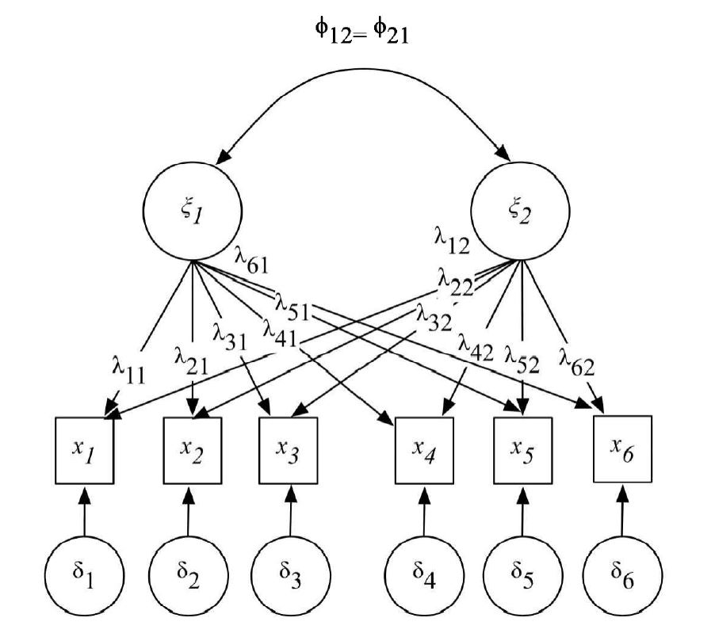
``` 


</div>
<div id="right">
 <div align="justify">
  <font size="6">
   <p class="small">
Asumimos que el investigador <span style="color:blue">no tiene una hipótesis a priori</span> acerca de qué estructura es la adecuada (un único componente de la inteligencia o dos), decidirá efectuar un <span style="color:blue">análisis factorial exploratorio</span> para ver cuántos factores obtiene.
</p>
</font>
</div> 
</div>


## Introducción

<div id="left">

```{r echo = FALSE, out.width = "100%"}

``` 


</div>
<div id="right">
 <div align="justify">
  <font size="6">
   <p class="small">
* Las <span style="color:blue">variables observadas</span> o <span style="color:blue">manifiestas</span> o <span style="color:blue">indicadores</span>, es decir, aquellas que se han medido (las <span style="color:blue">notas de los alumnos</span>), aparecen insertadas en un cuadrado para señalar
que tienen este carácter y las hemos denotado como <span style="color:blue">$x_1,\ldots,x_6$</span>.
* Las <span style="color:green">variables latentes</span>, esto es las no observables o subyacentes (por ejemplo, factores como la inteligencia, en <span style="color:brown">general</span>, o la inteligencia <span style="color:brown">verbal</span> o <span style="color:brown">cuantitativa</span>, en particular), aparecen <span style="color:green">rodeadas por círculos</span>.
</p>
</font>
</div> 
</div>

## Introducción

<div id="left">

```{r echo = FALSE, out.width = "100%"}

``` 


</div>
<div id="right">
 <div align="justify">
  <font size="6">
   <p class="small">
* Una <span style="color:blue">flecha recta</span> desde una <span style="color:blue">variable latente</span> a una <span style="color:blue">variable observada</span> indica una relación de <span style="color:red">influencia directa</span>.
* Asi el <span style="color:green">factor $\xi$</span> esta <span style="color:green">“causando”</span> las <span style="color:green">notas de los alumnos</span> en las seis asignaturas, es decir, la <span style="color:brown">mayor o menor</span> inteligencia <span style="color:brown">“cuantitativa”</span> provoca que los alumnos tengan <span style="color:brown">notas diferentes</span>.
</p>
</font>
</div> 
</div>

## Introducción

<div id="left">

```{r echo = FALSE, out.width = "100%"}

``` 


</div>
<div id="right">
 <div align="justify">
  <font size="5.9">
   <p class="small">
* El término <span style="color:blue">$\lambda$</span> que aparece en cada una de las <span style="color:blue">relaciones causales</span>
o *paths* es el parámetro que <span style="color:blue">mide la intensidad de la relación</span>, esto es, el término que hemos denominado <span style="color:red">carga factorial</span> en un análisis factorial exploratorio y cuya denominación mantendremos en el confirmatorio.
* Las <span style="color:brown">variables latentes</span> son de <span style="color:brown">dos tipos</span>: los mencionados <span style="color:green">factores comunes ($\xi$)</span>, que son <span style="color:green">comunes</span> en cuanto que sus <span style="color:green">efectos</span> son <span style="color:green">compartidos</span> por mas de una variable observada, y los <span style="color:blue">factores específicos o errores ($\delta$)</span> .
</p>
</font>
</div> 
</div>

## Introducción

<div id="left">

```{r echo = FALSE, out.width = "100%"}

``` 


</div>
<div id="right">
 <div align="justify">
  <font size="6">
   <p class="small">
* Cada uno de estos factores afecta solamente a una variable observada, y son <span style="color:blue">errores aleatorios</span> que se pueden haber producido en la <span style="color:blue">medida de la variable observada</span> (el estudiante puede ser <span style="color:brown">bueno copiando</span> en el examen o el profesor <span style="color:brown">equivocarse al corregir</span>).
* Finalmente, la <span style="color:green">flecha curva</span> con dos puntas que <span style="color:green">une a los factores comunes</span> indica que estas <span style="color:brown">variables</span> pueden estar <span style="color:brown">correlacionadas</span> con una <span style="color:brown">intensidad $\phi$</span>.

</p>
</font>
</div> 
</div>

## Introducción

<div id="left">

```{r echo = FALSE, out.width = "100%"}
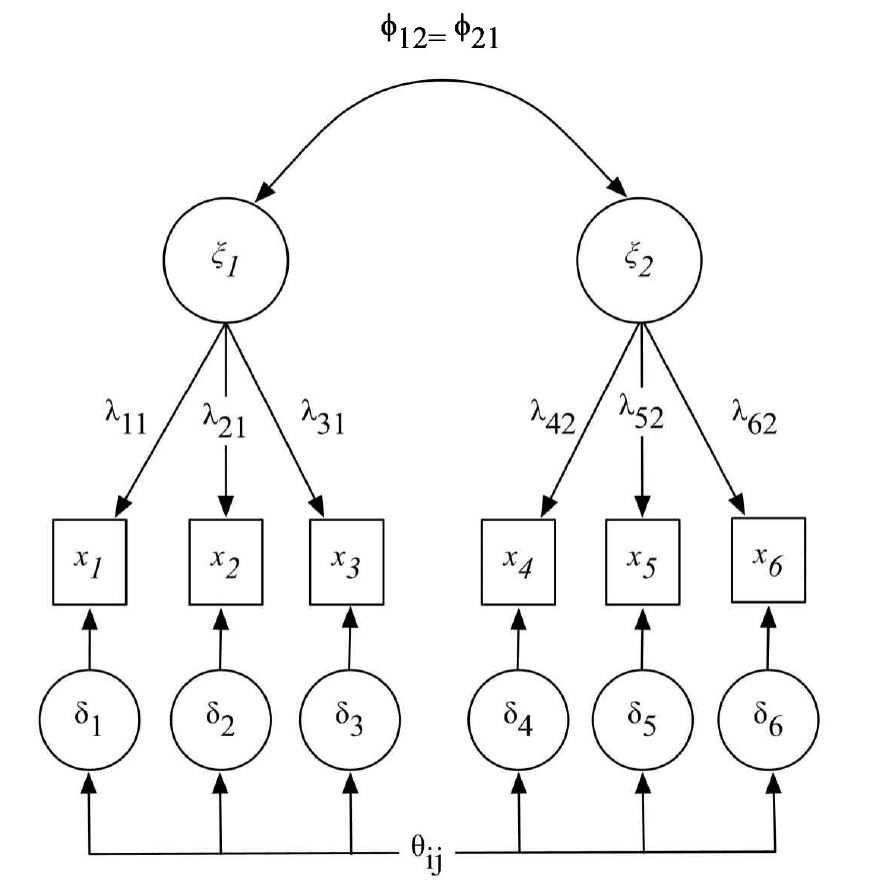
``` 


</div>
<div id="right">
 <div align="justify">
  <font size="5.9">
   <p class="small">
Ahora bien, el investigador, basándose en <span style="color:blue">estudios previos</span> o en una <span style="color:blue">revisión
de la literatura</span> existente, puede considerar la hipótesis, por ejemplo, de que
no existe una medida global de la inteligencia sino dos tipos alternativos de la misma: <span style="color:blue">inteligencia verbal</span> (que explicaría las calificaciones en lengua, filosofía e historia) e <span style="color:blue">inteligencia cuantitativa</span> (que explicaría las obtenidas en matemáticas, física y química). Si este es el caso, el análisis exploratorio ya no tiene sentido, ya que el investigador lo que pretende es <span style="color:blue">confirmar o no la verosimilitud de su hipótesis</span>.
</p>
</font>
</div> 
</div>

## Formalización

<div align="justify">
<font size="6">
La <span style="color:blue">relación</span> entre las <span style="color:green">variables observadas</span> y las <span style="color:green">latentes</span> puede expresarse:
<center>
```{r echo = FALSE, out.width = "20%"}
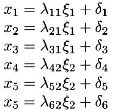
``` 
</center>
Si recurrimos a la <span style="color:blue">notación matricial</span>, la anterior expresión adoptaría la forma:
<center>
```{r echo = FALSE, out.width = "30%"}
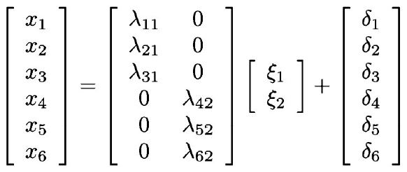
``` 
</center>
</font>
</div>


## Formalización

<div align="justify">
<font size="6">
o de manera compacta:
$$\boldsymbol{x}=\boldsymbol{\Lambda} \xi+\delta$$
donde, en general y no solo para este modelo, <span style="color:blue">$\boldsymbol{x}$</span> es un vector $q \times 1$ que contiene las $q$ <span style="color:blue">variables observadas</span> o indicadores, <span style="color:green">$\xi$</span> es un vector $s \times 1$ que contiene los $s$ <span style="color:green">factores comunes</span>, <span style="color:brown">$\boldsymbol{\Lambda}$</span> es una matriz $q \times s$ que contiene las <span style="color:brown">cargas factoriales</span> y <span style="color:blue">$\delta$ </span> es el vector $q \times 1$  de los <span style="color:blue">factores especificos o errores</span>. Asumimos que el <span style="color:green">número de variables observadas</span> será <span style="color:green">siempre mayor</span> que el de <span style="color:green">factores comunes</span> o, lo que es lo mismo, que $q > s$.
</font>
</div>

## Formalización

<div align="justify">
<font size="6">
Si denotamos como $\Sigma$ a la matriz de varianzas y covarianzas entre las variables observadas (vector $\boldsymbol{x}$) resulta que:
$$\Sigma=E(\boldsymbol{x} \boldsymbol{x}^\top)=E\left[(\boldsymbol{\Lambda} \xi+\delta)(\boldsymbol{\Lambda} \xi+\delta)^\top\right]$$
que puede expresarse de la siguiente forma:
$$\Sigma=\boldsymbol{\Lambda} \boldsymbol{\Phi} \boldsymbol{\Lambda}^\top+\boldsymbol{\Theta}$$
donde $\boldsymbol{\Phi}=E[\xi\xi^\top]$, $\boldsymbol{\Theta}=E[\delta \delta^\top]$ y asumimos que $\delta$ y $\phi$ estan incorrelacionados.
</font>
</div>


## Formalización

<div align="justify">
<font size="6">
Aplicado a nuestro ejemplo, las matrices que contienen los parámetros que se deben estimar adoptaran la forma siguiente:
<center>
```{r echo = FALSE, out.width = "30%"}
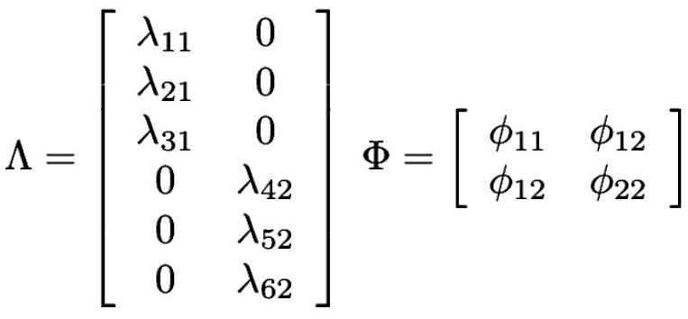
``` 
</center>
y
<center>
```{r echo = FALSE, out.width = "30%"}
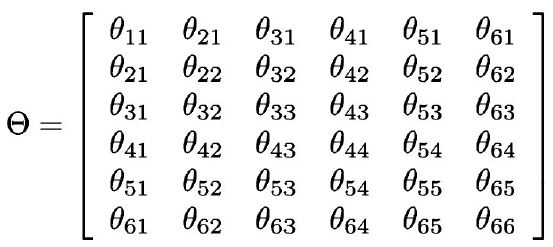
``` 
</center>
</font>
</div>

## Finalidad del CFA

<div align="justify">
<font size="6">
La <span style="color:blue">finalidad de este método</span> es obtener <span style="color:blue">estimaciones</span> para los parámetros que contienen las matrices $\boldsymbol{\Lambda}$, $\boldsymbol{\Theta}$ y $\boldsymbol{\Phi}$ que hagan que la <span style="color:green">matriz de varianzas y covarianzas poblacional $\Sigma$ estimada</span>, obtenida a partir de ellas, sea lo <span style="color:green">más parecida</span> posible a la <span style="color:green">matriz de varianzas y covarianzas muestral</span> $\boldsymbol{S}$ que se obtiene a partir de los valores muestrales de las variables observadas.
</font>
</div>

## La identificación del modelo en un CFA

<div align="justify">
<font size="6">
<p>
- 1 correlación $\phi_{12}$ entre los factores $\xi_1$ y $\xi_2$.
- 2 varianzas de los factores $\xi_1$ y $\xi_2$, esto es, $\phi_{11}$ y $\phi_{22}$.
- 6 cargas factoriales $\lambda_{ij}$ que unen los factores $\xi_1$ y $\xi_2$ con los 6 indicadores $x_i$.
- 6 coeficientes de regresión entre los términos de error y los indicadores.
- 6 varianzas de los términos de error $\delta_i$, que hemos denotado como $\theta_{11} \ldots \theta_{66}$.
- 15 covarianzas entre los términos de error $\delta_i$, que ya hemos apuntado
fijaremos a 0 inicialmente en el proceso de identificación.
</p>
</font>
</div>

## Decisiones de identificación en ejemplo

<div align="justify">
<font size="6">
<p>
- Hemos establecido la <span style="color:blue">escala de medida de cada factor</span> fijando a <span style="color:blue">1 la
varianza del mismo</span>.
- Hemos <span style="color:blue">fijado a cero</span> las <span style="color:blue">15 correlaciones</span> entre los <span style="color:blue">términos de error</span>.
- Hemos <span style="color:blue">fijado a 1</span> los <span style="color:blue">6 coeficientes de regresión</span> entre los <span style="color:blue">términos de
error y los indicadores</span>.
- Se ha permitido que las <span style="color:blue">covarianzas entre los factores sean no
nulas</span> (la única existente, $\phi_{12}$, aparece con un * para ser estimada).
- Vamos a comprobar que contamos con grados de libertad, es decir,
tenemos <span style="color:blue">más datos</span> (varianzas y covarianzas muestrales) <span style="color:blue">que parámetros
para estimar</span> y en nuestro caso contamos con 8 grados de libertad.
</p>
</font>
</div>

## Paquetes en R a utilizar en el ejemplo


```
library (lavaan)
library(semTools)
library(semPlot)
library(ggplot2)

```
```{r echo=FALSE, warning=FALSE, message=FALSE}

library (lavaan)
library(semTools)
library(semPlot)
library(ggplot2)

```

Luego se procederá a ingresar la matriz de correlaciones de las notas de los 275 estudiantes

## Datos a ingresar

```
#Conversión del vector de correlaciones en una matriz que llamamos datos.cor
#Definimos el vector que llamamos x

x <- c(1.000,
       .493,1.000,
       .401,.314,1.000,
       .278,.347,.147,1.000,
       .317,.318,.183,.587,1.000,
       .284,.327,.179,.463,.453,1.000)

#Convertimos el vector x en la matriz datos.cor
datos.cor<-lav_matrix_lower2full(x)

#Etiquetamos a las variables de la matriz

colnames(datos.cor) <- rownames(datos.cor) <- 
  c("L","FSF", "H","M","FSC","Q")

```

```{r echo=FALSE, warning=FALSE, message=FALSE}

#Conversión del vector de correlaciones en una matriz que llamamos datos.cor
#Definimos el vector que llamamos x

x <- c(1.000,
       .493,1.000,
       .401,.314,1.000,
       .278,.347,.147,1.000,
       .317,.318,.183,.587,1.000,
       .284,.327,.179,.463,.453,1.000)

#Convertimos el vector x en la matriz datos.cor
datos.cor<-lav_matrix_lower2full(x)

#Etiquetamos a las variables de la matriz

colnames(datos.cor) <- rownames(datos.cor) <- 
  c("L","FSF", "H","M","FSC","Q")

```


## Datos a ingresar

```
#Pedimos la visualización de la matriz datos.cor
datos.cor

```

```{r echo=FALSE, warning=FALSE, message=FALSE}

#Pedimos la visualización de la matriz datos.cor
datos.cor

```


## Datos a ingresar

```
#Introducimos las desviaciones típicas SD
datos.sd <- c(1.090, 0.590, 0.980, 1.100, 0.410, 1.110)

names(datos.sd) <-
  c("L","FSF", "H","M","FSC","Q")

#Pedimos la visualización de la matriz datos.cor
datos.sd

```
```{r echo=FALSE, warning=FALSE, message=FALSE}

#Introducimos las desviaciones típicas SD
datos.sd <- c(1.090, 0.590, 0.980, 1.100, 0.410, 1.110)

names(datos.sd) <-
  c("L","FSF", "H","M","FSC","Q")

#Pedimos la visualización de la matriz datos.cor
datos.sd

```

## Datos a ingresar

<div align="justify">
<font size="6">
<p>
El <span style="color:blue">CFA </span> se <span style="color:blue">estima</span> ajustando las <span style="color:blue">matrices de varianzas y covarianzas</span>, no de correlaciones, por lo que es necesario pasar de una a otra. Pero solo se
pueden obtener las covarianzas a partir de las correlaciones si se conocen las
desviaciones típicas, como es el caso. Las vamos a introducir como un vector al que llamamos `datos.sd`. Finalmente utilizamos la función `cor2cov{lavaan}` para <span style="color:blue">convertir</span> la <span style="color:green">matriz de correlaciones</span> en <span style="color:green">matriz de varianzas y covarianzas</span> dadas las desviaciones típicas.
</p>
</font>
</div>


## Datos a ingresar

```
#Convertimos las correlaciones y desviaciones típicas en varianzas y covarianzas
datos.cov<-cor2cov(datos.cor,datos.sd)

#Pedimos la visualización de la matriz datos.cor
datos.cov

```
```{r echo=FALSE, warning=FALSE, message=FALSE}

#Convertimos las correlaciones y desviaciones típicas en varianzas y covarianzas
datos.cov<-cor2cov(datos.cor,datos.sd)

#Pedimos la visualización de la matriz datos.cor
datos.cov

```

## Planteamiento del modelo CFA en R


```
modelo.cfa <- '

# Modelo de medida

IV  =~ L+FSF+H
IQ  =~ M+FSC+Q


#Varianzas de los factores

IV~~1*IV
IQ~~1*IQ

#Covarianzas

IV~~IQ

#Varianzas de los términos de error

L~~L
FSF~~FSF
H~~H
M~~M
FSC~~FSC
Q~~Q
'

```
```{r echo=FALSE, warning=FALSE, message=FALSE}

modelo.cfa <- '

# Modelo de medida

IV  =~ L+FSF+H
IQ  =~ M+FSC+Q


#Varianzas de los factores

IV~~1*IV
IQ~~1*IQ

#Covarianzas

IV~~IQ

#Varianzas de los términos de error

L~~L
FSF~~FSF
H~~H
M~~M
FSC~~FSC
Q~~Q
'

```


## Planteamiento del modelo CFA en R


<div align="justify">
```
IV  =~ L+FSF+H
IQ  =~ M+FSC+Q

```
<font size="6">
<p>
- El <span style="color:blue">investigador</span> decide el <span style="color:blue">nombre</span> que le quiere dar a los <span style="color:blue">factores</span>, mientras que los <span style="color:green">indicadores</span> han de conservar el <span style="color:green">nombre de la base de datos</span>.
- El <span style="color:blue">factor</span>, a la izquierda del `=~` viene definido por la suma de los indicadores a la derecha del signo (p.ej. `IV =~ L+FSF+H`).
- Obsérvese que no se añaden los términos de error, el paquete los asume por
defecto.
</p>
</font>
</div>

## Planteamiento del modelo CFA en R

<div align="justify">
<font size="6">
<p>
- Las <span style="color:blue">varianzas de los factores</span>, se señalan separando el nombre del factor de
sí mismo por el signo `~~` (p.ej. `IV~~IV`).
- Las <span style="color:blue">varianzas de los errores</span> siguen la misma terminología, con la diferencia de que los elementos separados por el `~~` son ahora indicadores, no factores (p.ej. `FSF~~FSF`).
- También el signo `~~` separa las <span style="color:blue">covarianzas</span> (e.g. `IV~~IQ`), pero no puede haber confusión porque lo que separa el signo son ahora factores distintos (en las varianzas a los dos lados esta el mismo factor, como es lógico).
</p>
</font>
</div>

## Proceso de identificación en la síntaxis

<div align="justify">
<font size="6">
<p>
- Están las covarianzas.
- No hay covarianzas entre los errores.
- Al no aparecer el término de error en las ecuaciones, se asume que su coeficiente de regresión esta fijado a 1.
</p>
</font>
</div>

## Proceso de identificación en la síntaxis

<div align="justify">
```
IV~~1*IV
IQ~~1*IQ
```
<font size="6">
La imagen muestra como se hace para fijar a 1 la varianza de los factores
</font>
</div>

## Modelo mal especificado

<div align="justify">
<font size="6">
Algunos indicadores que nos pueden hacer sospechar que el modelo esta incorrectamente identificado:
<p>
- <span style="color:blue">Errores estándar muy grandes</span> para la estimación de <span style="color:blue">algunos coeficientes</span>.
- <span style="color:blue">Incapacidad del programa para invertir la matriz</span> que, como veremos inmediatamente, es necesario en el proceso de estimación (se suele indicar señalando que no es definida positiva).
- <span style="color:blue">Estimaciones teóricamente imposibles</span> como <span style="color:green">varianzas negativas</span> y valores estandarizados de cargas y <span style="color:green">correlaciones fuera del rango [—1, +1]</span>.
</p>
</font>
</div>

## Métodos de estimación del modelo

<div align="justify">
<font size="6">
<p>
- Mínimos cuadrados no ponderados (ULS)
- Mínimos cuadrados generalizados (GLS)
- Máxima verosimilitud (ML)
- Estimación por la teoría de la distribución elíptica (EDT)
- Estimación con libre distribución asintótica (ADF)
</p>
</font>
</div>

## Comparación de los distintos procedimientos de estimación

<div align="justify">
<font size="6">
<p>
- Los métodos de <span style="color:blue">ML</span> y <span style="color:blue">GLS</span> son la mejor opción con <span style="color:blue">pequeñas muestras</span> siempre que sea <span style="color:blue">plausible</span> la asunción de <span style="color:blue">normalidad e independencia</span>.
- La <span style="color:blue">normalidad</span> es necesaria para que los <span style="color:green">errores estándar sean
fiables</span> y el <span style="color:green">estadístico t</span> que utilizamos para calcular la <span style="color:green">significatividad de los parámetros sea confiable</span>
</p>
</font>
</div>

## Estimación del modelo

<div id="left">
```
#Estimación del modelo

fit <- lavaan(modelo.cfa, sample.cov=datos.cov, sample.nobs=275, std.lv=TRUE, mimic="eqs", estimator="ML", verbose=TRUE, warn=TRUE) 

```
```{r echo=FALSE, warning=FALSE, message=FALSE}

#Estimación del modelo

fit <- lavaan(modelo.cfa, sample.cov=datos.cov, sample.nobs=275, std.lv=TRUE, mimic="eqs", estimator="ML", verbose=TRUE, warn=TRUE) 

```


</div>
<div id="right">
 <div align="justify">
  <font size="5.9">
   <p class="small">
- En primer lugar, se crea un objeto de `R`, con el nombre de `fit`, que va a recoger toda la información
de la estimación.
- La instrucción `lavaan()` pide que se estime el modelo y su estructura es la siguiente: `modelo.cfa` es el modelo que hemos definido, `datos.cov` son los datos que se van a utilizar, como hemos ingresado la matriz de varianza covarianza tenemos que indicar el tamaño del conjunto de datos `sample.nobs=275`, `estimator="ML"` para indicar que método de estimación utilizará y `warn=TRUE` nos avisa si ha habido algún problema en el proceso de estimación. Usar `std.lv=TRUE` es más eficiente que la especificación de la varianza en el modelo.
</p>
</font>
</div> 
</div>

## Estimación del modelo

<div id="left">
```
#Petición de elementos en la salida
summary (fit, fit.measures=TRUE, standardized=TRUE, rsquare=TRUE)
```
```{r echo=FALSE, warning=FALSE, message=FALSE}

#Petición de elementos en la salida
summary (fit, fit.measures=TRUE, standardized=TRUE, rsquare=TRUE)
```


</div>
<div id="right">
 <div align="justify">
  <font size="6">
   <p class="small">
- `fit.measures=TRUE` pide que se amplie el número de indicadores de ajuste que se muestran por defecto.
- `standardized=TRUE` pide que junto con las estimaciones no estandarizadas de los parámetros ofrezca también las estandarizadas.
- `rsquare=TRUE` pide que para la ecuación de cada indicador nos indique el porcentaje de varianza que explica el factor del mismo.
</p>
</font>
</div> 
</div>

## Estimación del modelo

<div id="left">
```
#Petición de elementos en la salida
resid(fit, type="cor")

```
```{r echo=FALSE, warning=FALSE, message=FALSE}

#Petición de elementos en la salida
resid(fit, type="cor")

```


</div>
<div id="right">
 <div align="justify">
  <font size="6">
   <p class="small">
`resid(fit,type="cor")` solicita que se muestren las diferencias para cada elemento de la matriz de varianzas y covarianzas entre el valor muestral y el estimado.
</p>
</font>
</div> 
</div>

## Estimación del modelo

<div id="left">
```
#Petición de elementos en la salida
summary (fit, fit.measures=TRUE, standardized=TRUE, rsquare=TRUE)
```
```{r echo=FALSE, warning=FALSE, message=FALSE}

#Petición de elementos en la salida
summary (fit, fit.measures=TRUE, standardized=TRUE, rsquare=TRUE)
```


</div>
<div id="right">
<center>
```{r echo = FALSE, out.width = "40%"}
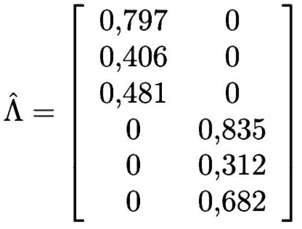
``` 
</center>
 <div align="justify">
  <font size="5.9">
   <p class="small">
- La primera información importante contiene la matriz con las cargas estimadas $\widehat{\boldsymbol{\Lambda}}$
- El cuadro nos muestra la estimación no estandarizada de las cargas (`Estimate`), el error estándar de la estimación y, derivado de ello, el valor del estadístico t, que etiqueta como `z-value` ($t=\widehat{\lambda}/SE$), a continuación ofrece la significatividad de ese parámetro o `P(>|z|)` y el valor estandarizado de la carga `Std.all`.
</p>
</font>
</div> 
</div>


## Estimación del modelo

<div id="left">
```
#Petición de elementos en la salida
summary (fit, fit.measures=TRUE, standardized=TRUE, rsquare=TRUE)
```
```{r echo=FALSE, warning=FALSE, message=FALSE}

#Petición de elementos en la salida
summary (fit, fit.measures=TRUE, standardized=TRUE, rsquare=TRUE)
```


</div>
<div id="right">
<center>
```{r echo = FALSE, out.width = "100%"}
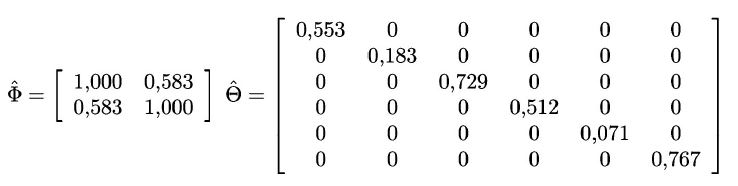
``` 
</center>
 <div align="justify">
  <font size="5.9">
   <p class="small">
- El valor de la covarianza entre los factores es 0.583. Los elementos etiquetados como .L .FSF .H .M .FSC y .Q son las varianzas de los términos de error de los indicadores.
- Por lo tanto, las matrices $\widehat{\Phi}$ y la matriz $\widehat{\Theta}$ quedan como en la figura.
</p>
</font>
</div> 
</div>

## Bondad de ajuste del modelo estimado

<div id="left">
```
#Petición de elementos en la salida
summary (fit, fit.measures=TRUE, standardized=TRUE, rsquare=TRUE)
```
```{r echo=FALSE, warning=FALSE, message=FALSE}

#Petición de elementos en la salida
summary (fit, fit.measures=TRUE, standardized=TRUE, rsquare=TRUE)
```


</div>
<div id="right">
<center>
</center>
 <div align="justify">
  <font size="6">
   <p class="small">
<span style="color:blue">Estadístico $\mathcal{X}^2$</span> <br>
- La <span style="color:blue">hipótesis nula es que la matriz de varianzas y covarianzas muestral y la teórica son iguales </span>(lo que implicaría ajuste perfecto). <br>
- El nivel de significancia <span style="color:green">$(p = 0.356)$ no nos permite rechazar la hipótesis nula de igualdad entre las matrices</span> y, por lo tanto, confirma el <span style="color:brown">buen ajuste del modelo</span>.
</p>
</font>
</div> 
</div>

## Bondad de ajuste del modelo estimado

<div id="left">
```
#Petición de elementos en la salida
summary (fit, fit.measures=TRUE, standardized=TRUE, rsquare=TRUE)
```
```{r echo=FALSE, warning=FALSE, message=FALSE}

#Petición de elementos en la salida
summary (fit, fit.measures=TRUE, standardized=TRUE, rsquare=TRUE)
```


</div>
<div id="right">
<center>
</center>
 <div align="justify">
  <font size="6">
   <p class="small">
- El SRMR (Standardized Root Mean Residual) es un <span style="color:blue">indicador de ajuste absoluto</span>, en la medida en que evalúa la <span style="color:green">plausibilidad</span> de que las <span style="color:green">matrices de varianzas y covarianzas muestral y estimada sean la misma</span>.
- Cuanto <span style="color:brown">mas pequeño</span> sea el valor del SRMR, <span style="color:brown">mejor será el ajuste</span>. 
- Valores <span style="color:blue">inferiores a 0.08</span> denotan un <span style="color:blue">buen ajuste</span>.
</p>
</font>
</div> 
</div>

## Bondad de ajuste del modelo estimado

<div id="left">
```
#Petición de elementos en la salida
summary (fit, fit.measures=TRUE, standardized=TRUE, rsquare=TRUE)
```
```{r echo=FALSE, warning=FALSE, message=FALSE}

#Petición de elementos en la salida
summary (fit, fit.measures=TRUE, standardized=TRUE, rsquare=TRUE)
```


</div>
<div id="right">
<center>
</center>
 <div align="justify">
  <font size="6">
   <p class="small">
- Para el indicador RMSEA (Root Mean Square Error of Approximation) se obtiene un <span style="color:blue">buen ajuste</span> cuando <span style="color:blue">RMSEA<0.05</span>, un <span style="color:green">ajuste aceptable</span> cuando está entre (<span style="color:green">0.05<RMSEA<0.08</span>) y un ajuste <span style="color:brown">pobre</span> si <span style="color:brown">RMSEA>0.08</span>.
- Puede comprobarse como no solo el <span style="color:blue">RMSEA es inferior a 0.05 (es 0.02)</span> sino que el mencionado <span style="color:brown">test no puede descartarla hipótesis nula de que el RMSEA es inferior a 0.05 (p=0.758)</span>.
</p>
</font>
</div> 
</div>

## Bondad de ajuste del modelo estimado

<div id="left">
```
#Petición de elementos en la salida
summary (fit, fit.measures=TRUE, standardized=TRUE, rsquare=TRUE)
```
```{r echo=FALSE, warning=FALSE, message=FALSE}

#Petición de elementos en la salida
summary (fit, fit.measures=TRUE, standardized=TRUE, rsquare=TRUE)
```


</div>
<div id="right">
<center>
</center>
 <div align="justify">
  <font size="6">
   <p class="small">
- Un modelo tendrá un <span style="color:blue">buen ajuste</span> de acuerdo al indicador Tucker-Lewis Index (TLI) cuando su <span style="color:blue">TLI >0.90</span>, lo cual sucede con el obtenido en el ejemplo.
- Para el indicador Comparative Fit Index (CFl) tenemos que si esta <span style="color:green">entre [0,90-0,95] es aceptable</span> y si es  <span style="color:brown">>0,95 es bueno</span>. En nuestro caso se obtiene un valor bueno.
</p>
</font>
</div> 
</div>


## Bibliografía complementaria

<div id="left">
```{r echo = FALSE, out.width = "70%"}

``` 

</div>
<div id="right">
```{r echo = FALSE, out.width = "100%"}
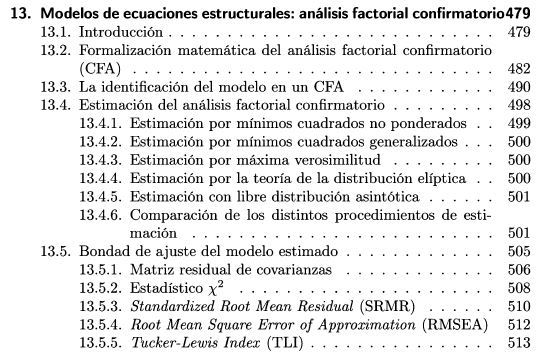
``` 
</div>

## Bibliografía complementaria

<div id="left">
```{r echo = FALSE, out.width = "70%"}

``` 

</div>
<div id="right">
```{r echo = FALSE, out.width = "70%"}
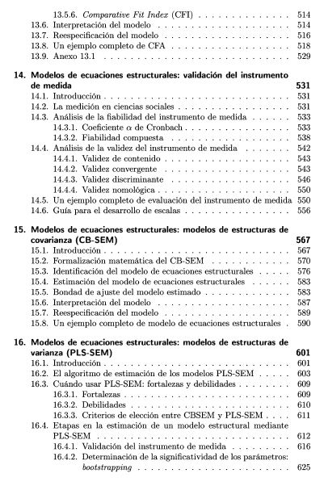
``` 
</div>

## Bibliografía complementaria

<div id="left">
```{r echo = FALSE, out.width = "70%"}
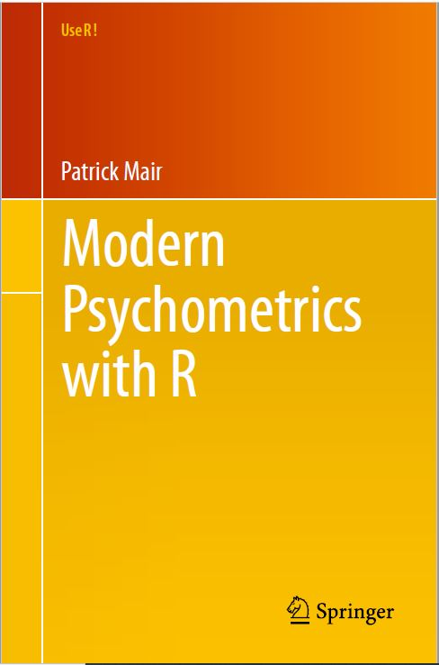
``` 

</div>
<div id="right">
```{r echo = FALSE, out.width = "100%"}
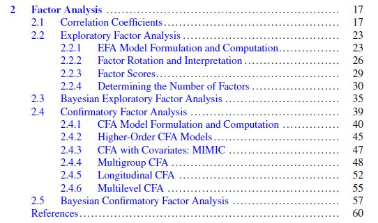
``` 
</div>

## Bibliografía complementaria

<div id="left">
```{r echo = FALSE, out.width = "70%"}

``` 

</div>
<div id="right">
```{r echo = FALSE, out.width = "100%"}
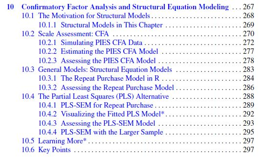
``` 
</div>

## Bibliografía complementaria

<div id="left">
```{r echo = FALSE, out.width = "70%"}

``` 

</div>
<div id="right">
```{r echo = FALSE, out.width = "100%"}
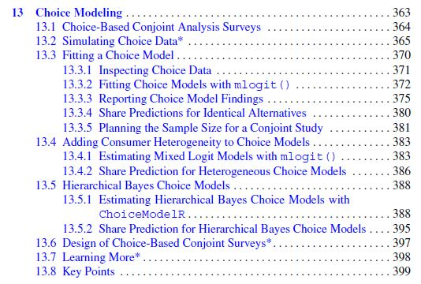
``` 
</div>

## Bibliografía complementaria

<div id="left">
```{r echo = FALSE, out.width = "100%"}
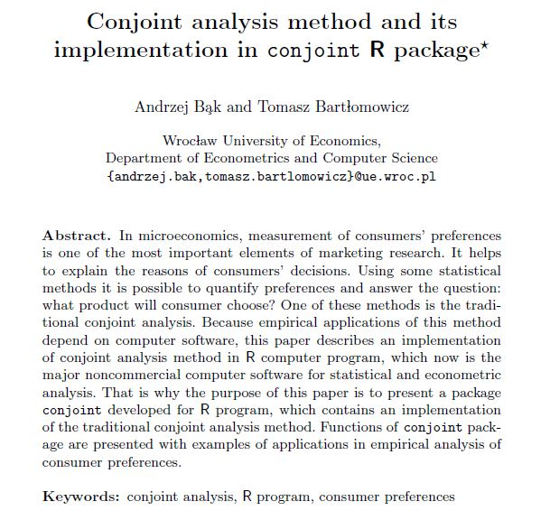
``` 

</div>
<div id="right">
```{r echo = FALSE, out.width = "70%"}
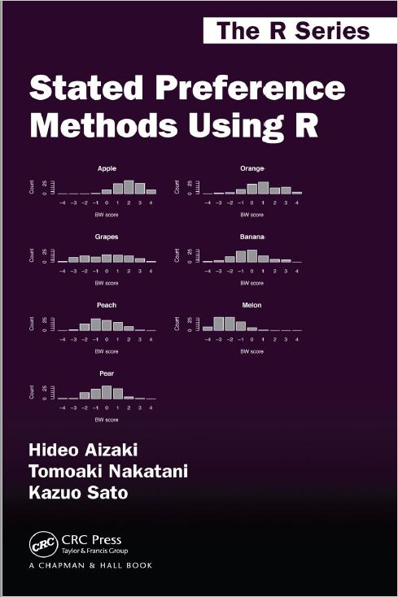
``` 
</div>

## Bibliografía complementaria

<div id="left">
```{r echo = FALSE, out.width = "150%"}

``` 

</div>
<div id="right">
[jlopezsi/MDSConjoint](https://rdrr.io/github/jlopezsi/MDSConjoint/)
</div>
