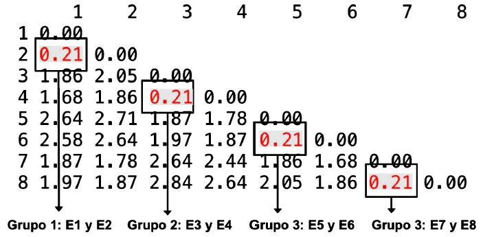
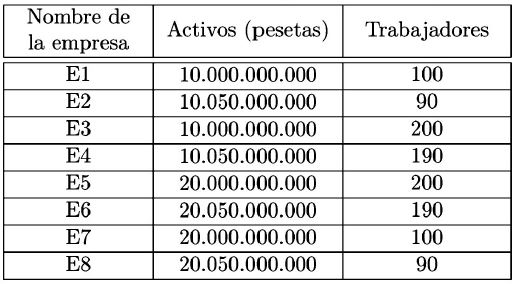

```{r setup, include=FALSE}
knitr::opts_chunk$set(echo = TRUE)
```

## Introducción

<div align="justify">
Supóngase que el responsable de marketing de una empresa tiene una base
de datos con las <span style="color:red">características sociodemográficas de sus clientes</span>: <span style="color:blue">edad</span>, <span style="color:blue">nivel
educativo</span>, <span style="color:blue">nivel de ingresos</span>, <span style="color:blue">estado civil</span>, <span style="color:blue">tipo de ocupación</span>, <span style="color:blue">número de hijos</span>,
etc. <br>
Este directivo se plantea si podría <span style="color:green">dividir a sus clientes en subgrupos</span>,
que tuvieran <span style="color:green">características sociodemográficas similares entre sí</span>, pero que <span style="color:brown">unos
subgrupos de otros</span>, fueran <span style="color:brown">lo más diferentes posibles</span>. 
</div>

## Introducción

<div align="justify">
Si esto fuera posible, el directivo de marketing podría, por ejemplo, <span style="color:blue">diseñar campañas de publicidad distintas para cada grupo</span>, con <span style="color:green">creatividades diferentes</span> o <span style="color:brown">utilizando diarios, revistas o cadenas de televisión distintas</span> según el grupo al que fuera dirigida la campaña.
</div>

## Introducción

<div align="justify">
E] análisis de conglomerados, al que también se denomina comúnmente
análisis cluster, es una técnica diseñada para clasificar distintas observaciones en grupos, de tal forma que:

* Cada grupo (conglomerado o cluster) sea homogéneo respecto a las variables
utilizadas para caracterizarlo, es decir, que cada observación contenida
en él sea parecida a todas las que estén incluidas en ese grupo.

* Que los grupos sean lo más distintos posible unos de otros respecto a las
variables consideradas.
</div>

## Introducción

<div align="justify">
Es importante señalar, para distinguir el análisis de conglomerados de otras
técnicas tratadas anteriormente, que los grupos son desconocidos
a priori y es necesario derivarlos de las observaciones. En el análisis discriminante o la regresión logística, por ejemplo, las observaciones ya estan previamente clasificadas en dos o más grupos, buscándose las razones que explican esa clasificación y no la clasificación en sí.
</div>

## Proceso del análisis de conglomerados

<div id="left">

```{r echo = FALSE, out.width = "100%"}
knitr::include_graphics("images/proc_congl.JPG")
``` 


</div>
<div id="right">
 <div align="justify">
  <font size="6">
   <p class="small">
* Inicialmente, el investigador dispone de $n$ observaciones (individuos, empresas, etc.) de las que tiene información sobre $k$ variables (edad, estado
civil, número de hijos...).

* A continuación, se establece un indicador que nos diga en qué medida
cada par de observaciones se parece entre sí. A esta medida se la denomina
distancia o (di)similaridad.
</p>
</font>
</div> 
</div>

## Proceso del análisis de conglomerados

<div id="left">

```{r echo = FALSE, out.width = "100%"}
knitr::include_graphics("images/proc_congl.JPG")
``` 


</div>
<div id="right">
 <div align="justify">
  <font size="6">
   <p class="small">
* Consiste en hacer grupos con aquellas observaciones
que mas se parezcan entre sí, de acuerdo con la medida de similaridad
calculada anteriormente. Ello exige elegir entre los dos tipos de análisis de
conglomerados: jerárquico y no jerárquico y el método de conglomeración
para el tipo de análisis elegido (centroide o vecino mas cercano, entre
otros, en el conglomerado jerárquico).
</p>
</font>
</div> 
</div>

## Proceso del análisis de conglomerados

<div id="left">

```{r echo = FALSE, out.width = "100%"}
knitr::include_graphics("images/proc_congl.JPG")
``` 


</div>
<div id="right">
 <div align="justify">
  <font size="6">
   <p class="small">
* Finalmente, el investigador debe describir los grupos que ha obtenido y
comparar los unos con los otros. Para ello bastará con ver qué valores
promedio toman las $k$ variables utilizadas en el análisis de conglomerados
en cada uno de los $g$ grupos obtenidos ($g < n$).
</p>
</font>
</div> 
</div>

## Ejemplo

<div align="justify">
**Relación entre la publicidad y las ventas ** <br>
Supongamos que un investigador tiene información del presupuesto que un
conjunto de empresas ha destinado a publicidad el ultimo año y de las ventas
que han logrado. Puede preguntarse si estas empresas pueden agruparse en función de la rentabilidad en términos de ventas que han sido capaces de generar con su inversión publicitaria.
</div>

## Ejemplo

<div align="justify">
**Relación entre la publicidad y las ventas ** <br>
Por ejemplo, el investigador puede examinar si existe un grupo de empresas que, invirtiendo en publicidad relativamente poco, ha logrado una elevada cifra de ventas o, por el contrario, si existe un grupo que, aun invirtiendo mucho en publicidad, no ha sido capaz de vender tanto como sus competidoras. 
En definitiva, ¿qué tipologia de empresas puede establecerse en función de la rentabilidad obtenida de su inversión publicitaria?
</div>

## Ejemplo

<div align="justify">

```
Empresa <- c("E1","E2","E3","E4","E5","E6","E7","E8")
Inversion_publicitaria <- c(16,12,10,12,45,50,45,50)
Ventas <- c(10,14,22,25,10,15,25,27)
datos <- data.frame(Inversion_publicitaria,Ventas)
attach(datos)
row.names(datos)<-Empresa
plot(Inversion_publicitaria,Ventas,pch=16,xlab="Inversión",ylab="Ventas",xlim=c(5,60),ylim=c(5,30))
with(datos, text(Ventas~Inversion_publicitaria, labels = row.names(datos), pos = 4))


```

</div>

## Ejemplo

<div id="left">

```{r echo=FALSE, warning=FALSE, message=FALSE}

Empresa <- c("E1","E2","E3","E4","E5","E6","E7","E8")
Inversion_publicitaria <- c(16,12,10,12,45,50,45,50)
Ventas <- c(10,14,22,25,10,15,25,27)
datos <- data.frame(Inversion_publicitaria,Ventas)
attach(datos)
row.names(datos)<-Empresa
plot(Inversion_publicitaria,Ventas,pch=16,xlab="Inversión",ylab="Ventas",xlim=c(5,60),ylim=c(5,30))
with(datos, text(Ventas~Inversion_publicitaria, labels = row.names(datos), pos = 4))


```


</div>
<div id="right">
 <div align="justify">
  <font size="6">
   <p class="small">
Al haber utilizado solo dos variables en el ejemplo planteado, este gráfico permite responder de una manera intuitiva a las preguntas que se hace el investigador. A la vista de este gráfico pueden distinguirse cuatro grupos de empresas:

* El grupo formado porlas empresas E1 y E2, que, con una pequeña inversión
en publicidad, han obtenido también pocas ventas.
</p>
</font>
</div> 
</div>

## Ejemplo

<div id="left">

```{r echo=FALSE, warning=FALSE, message=FALSE}

Empresa <- c("E1","E2","E3","E4","E5","E6","E7","E8")
Inversion_publicitaria <- c(16,12,10,12,45,50,45,50)
Ventas <- c(10,14,22,25,10,15,25,27)
datos <- data.frame(Inversion_publicitaria,Ventas)
attach(datos)
row.names(datos)<-Empresa
plot(Inversion_publicitaria,Ventas,pch=16,xlab="Inversión",ylab="Ventas",xlim=c(5,60),ylim=c(5,30))
with(datos, text(Ventas~Inversion_publicitaria, labels = row.names(datos), pos = 4))


```


</div>
<div id="right">
 <div align="justify">
  <font size="6">
   <p class="small">
* El grupo formado por las empresas E3 y E4, que, pese a haber invertido
tan poco como las empresas del grupo anterior, han obtenido una gran
rentabilidad en términos de ventas a estas inversiones.

* El grupo formado por las empresas E5 y E6, que, pese a haber efectuado
un gran esfuerzo publicitario, no han sido capaces de obtener unas ventas
razonables.


</p>
</font>
</div> 
</div>

## Ejemplo

<div id="left">

```{r echo=FALSE, warning=FALSE, message=FALSE}

Empresa <- c("E1","E2","E3","E4","E5","E6","E7","E8")
Inversion_publicitaria <- c(16,12,10,12,45,50,45,50)
Ventas <- c(10,14,22,25,10,15,25,27)
datos <- data.frame(Inversion_publicitaria,Ventas)
attach(datos)
row.names(datos)<-Empresa
plot(Inversion_publicitaria,Ventas,pch=16,xlab="Inversión",ylab="Ventas",xlim=c(5,60),ylim=c(5,30))
with(datos, text(Ventas~Inversion_publicitaria, labels = row.names(datos), pos = 4))


```


</div>
<div id="right">
 <div align="justify">
  <font size="6">
   <p class="small">
* El grupo formado por las empresas E7 y E8, que, con inversiones también
elevadas, si que han logrado, por el contrario, rentabilizar su inversión en
términos de ventas.

¿Cómo se han obtenido los grupos anteriores? De una manera intuitiva hemos
visto, por ejemplo, que la empresa E1 esta a una distancia menor de E2 que
de E3 o que de cualquiera de las empresas restantes, y las hemos puesto en
un mismo grupo. 

</p>
</font>
</div> 
</div>

## Ejemplo

<div id="left">

```{r echo=FALSE, warning=FALSE, message=FALSE}

Empresa <- c("E1","E2","E3","E4","E5","E6","E7","E8")
Inversion_publicitaria <- c(16,12,10,12,45,50,45,50)
Ventas <- c(10,14,22,25,10,15,25,27)
datos <- data.frame(Inversion_publicitaria,Ventas)
attach(datos)
row.names(datos)<-Empresa
plot(Inversion_publicitaria,Ventas,pch=16,xlab="Inversión",ylab="Ventas",xlim=c(5,60),ylim=c(5,30))
with(datos, text(Ventas~Inversion_publicitaria, labels = row.names(datos), pos = 4))


```


</div>
<div id="right">
 <div align="justify">
  <font size="6">
   <p class="small">
De manera análoga, e igualmente intuitiva, hemos procedido
con las demas empresas, llegando a la solución de cuatro grupos expuesta.
Pero ¿qué hubiera ocurrido si en lugar de dos variables pretendiésemos llevar
a cabo agrupaciones de observaciones teniendo en cuenta 5, 10 o 50 variables? 

</p>
</font>
</div> 
</div>


## Ejemplo

<div id="left">

```{r echo=FALSE, warning=FALSE, message=FALSE}

Empresa <- c("E1","E2","E3","E4","E5","E6","E7","E8")
Inversion_publicitaria <- c(16,12,10,12,45,50,45,50)
Ventas <- c(10,14,22,25,10,15,25,27)
datos <- data.frame(Inversion_publicitaria,Ventas)
attach(datos)
row.names(datos)<-Empresa
plot(Inversion_publicitaria,Ventas,pch=16,xlab="Inversión",ylab="Ventas",xlim=c(5,60),ylim=c(5,30))
with(datos, text(Ventas~Inversion_publicitaria, labels = row.names(datos), pos = 4))


```


</div>
<div id="right">
 <div align="justify">
  <font size="5.99">
   <p class="small">
La intuición debe dejar paso a la formalización. Sin embargo, ilustraremos el proceso que sigue el análisis de conglomerados con este ejemplo sencillo para,
finalmente, aplicarlo a una situación más real en el último epígrafe del capítulo. <br>

Lo primero que se ha hecho de manera intuitiva es ver que E1 esta mas cerca
de E2 que de E3. Este “más cerca” se traduce en el análisis de conglomerados
en el cálculo de alguna medida de proximidad o similaridad entre cada
par de observaciones.

</p>
</font>
</div> 
</div>

## Medidas de similaridad para variables métricas

<div align="justify">
<font size="6">
En el caso en que las variables que se utilizan para caracterizar las observaciones sean métricas, es decir, de intervalo o de razón, se puede
recurrir a cualquiera de las siguientes medidas de similaridad.<br>
**Distancia euclídea** <br>
Si consideramos dos observaciones $i$ y $j$ de las $n$ posibles y si llamamos $x_{ip}$ y $x_{jp}$ al valor que toma la variable $x_p$, de las $k$ existentes en dichas observaciones, la distancia euclídea $D_{ij}$ entre ambas se calcularia del siguiente modo:
$$D_{ij}=\sqrt{\sum_{p=1}^{k}(x_{ip}-x_{jp})^2}$$
</font>
</div>

## Medidas de similaridad para variables métricas

<div id="left">


```
datos
```
```{r echo=FALSE, warning=FALSE, message=FALSE}
datos
```


</div>
<div id="right">
 <div align="justify">
  <font size="6">
   <p class="small">
asi, por ejemplo, la distancia euclidea entre las empresas E1 y E2 tomael valor
siguiente:

$$D_{12}=\sqrt{(16-12)^2+(10-14)^2}=5.66$$
que es menor que la distancia existente entre las empresas E1 y E3:

$$D_{13}=\sqrt{(16-10)^2+(10-22)^2}=13.42$$

</p>
</font>
</div> 
</div>

## Ejemplo

<div id="left">


```
# Distancia euclidiana
matriz.dis.euclid <- dist(datos[,1:2],method="euclidian",diag=TRUE)
round(matriz.dis.euclid,2)

```
```{r echo=FALSE, warning=FALSE, message=FALSE}
# Distancia euclidiana
matriz.dis.euclid <- dist(datos[,1:2],method="euclidian",diag=TRUE)
round(matriz.dis.euclid,2)

```


</div>
<div id="right">
 <div align="justify">
  <font size="6">
   <p class="small">
La mayoria de algoritmos calculan las distancias entre todos los pares de
observaciones, como paso inicial del análisis de conglomerados. Mostramos la matriz euclidiana obtenida con el R con la función `dis()`

</p>
</font>
</div> 
</div>

## Medidas de similaridad para variables métricas

<div align="justify">
<font size="6">
**Distancia de Minkowski** <br>
Las distancia euclídea y distancia eucídea al cuadrado son un caso particular de la distancia de Minkowski, que viene dada porla expresión:
$$D_{ij}=[\sum_{p=1}^{k}|x_{ip}-x_{jp}|^n]^{1/n}$$
Puede comprobarse que haciendo $n = 2$ se obtiene la expresién correspondiente
a la distancia euclídea.
</font>
</div>

## Medidas de similaridad para variables métricas

<div align="justify">
<font size="6">
**Distancia city block o “Manhattan”** <br>
Si en la expresion de la distancia de Minkowski tomaramos $n = 1$, obtendríamos
la denominada distancia city block, la cuál viene dada por:
$$D_{ij}=\sum_{p=1}^{k}|x_{ip}-x_{jp}|^n$$
Puede comprobarse que haciendo $n = 2$ se obtiene la expresién correspondiente
a la distancia euclídea.
</font>
</div>

## Medidas de similaridad para datos binarios

<div align="justify">
<font size="6">
En algunas ocasiones, las variables utilizadas para caracterizar a las observaciones estén codificadas como ficticias, es decir, únicamente contemplan la presencia (1) o ausencia (0) del atributo considerado. Estas variables suelen aflorar en el proceso de codificación de atributos medidos en escalas nominales u ordinales.
</font>
</div>

## Estandarización de los datos

<div align="justify">
<font size="6">
Si se analizan con detenimiento las medidas de distancia presentadas, se puede comprobar que todas ellas estén basadas en la sustracción,
para cada par de observaciones, de los valores de las variables utilizadas en su caracterización. Por ello, se puede esperar que las medidas de disimilaridad sean muy sensibles a las unidades en que estén medidas dichas variables. 
Si pretendemos agrupar empresas en función de dos variables, como el tamaño de su activos medido en pesetas y el número de trabajadores, la primera variable contribuirá mucho mas a establecer los grupos que la segunda. Y esto no se debe a que conceptualmente una sea mucho mas importante que la otra, sino a que, con esas unidades, su valor absoluto será siempre muy superior.
</font>
</div>

## Estandarización de los datos

<div id="left">

```
nombre.empresa2<-c("E1","E2","E3","E4","E5","E6","E7","E8")
activos<-c(10.0e9,10.5e9,10.0e9,10.5e9,20.0e9,20.5e9,20.0e9,20.5e9)
trabajadores<-c(100,90,200,190,200,190,100,90)
Datos_EST<-data.frame(nombre.empresa2,activos,trabajadores)
Datos_EST

```

```{r echo=FALSE, warning=FALSE, message=FALSE}
nombre.empresa2<-c("E1","E2","E3","E4","E5","E6","E7","E8")
activos<-c(10.0e9,10.5e9,10.0e9,10.5e9,20.0e9,20.5e9,20.0e9,20.5e9)
trabajadores<-c(100,90,200,190,200,190,100,90)
Datos_SEST<-data.frame(nombre.empresa2,activos,trabajadores)
Datos_SEST
```


</div>
<div id="right">
 <div align="justify">
  <font size="5.99">
   <p class="small">
Los datos presentados recogen el tamaño de los activos y el número de trabajadores de ocho empresas hipotéticas. Si
efectuamos un análisis de conglomerados con las unidades originales, la matriz de distancias mostrará que los dos grupos obtenidos responden exclusivamente a la variable “activos de la empresa”, puesto que sitúa en un mismo grupo a aquellas con cifras que rondan los 10000 millones
de pesetas (E1, E2, E3 y E4) y en otro grupo a las que tienen activos en torno a los 20000 millones (E5, E6, E7 y E8).
</p>
</font>
</div> 
</div>

## Estandarización de los datos

<div id="left">

```
matriz.dis.euclid2<-dist(Datos_SEST[,c("activos","trabajadores")],method="euclidean",diag=TRUE)
matriz.dis.euclid2

```

```{r echo=FALSE, warning=FALSE, message=FALSE}
matriz.dis.euclid2<-dist(Datos_SEST[,c("activos","trabajadores")],method="euclidean",diag=TRUE)
matriz.dis.euclid2
```


</div>
<div id="right">
 <div align="justify">
  <font size="5.99">
   <p class="small">
Es decir, la influencia del número de trabajadores en la obtención de estos conglomerados es practicamente nula.
Para evitar esta influencia no deseable de una variable debida exclusivamente a la unidad en que viene medida es necesario corregir el efecto de los datos recurriendo a un proceso de estandarización. 
</p>
</font>
</div> 
</div>

## Estandarización de los datos

<div align="justify">
<font size="6">
**Puntuaciones Z** <br>
Los datos son estandarizados, restando al valor de cada observación de una variable determinada,la media de esa variable para el conjunto
de las observaciones y dividiendo el resultado por su desviación típica. De esta forma la variable estandarizada tiene media 0, y desviación típica, 1. <br>
**Rango 1** <br>
El valor de una variable dada en cada observación es dividido por el rango de esa variable para el conjunto de observaciones. De esta forma el rango de variación de la variable así estandarizada queda reducido a un intervalo de valor 1.
</font>
</div>

## Estandarización de los datos

<div align="justify">
**Rango 0 a 1** <br>
El valor de una variable determinada para cada observación es estandarizada sustrayéndole el valor mínimo que toma esa variable en el conjunto de las observaciones y a continuación dividiendo por el rango. De esta forma el valor mínimo de las variables sera 0, y el máximo, 1.
</div>

## Estandarización de los datos

<div id="left">

```
Datos_EST<-scale(Datos_SEST[,c("activos","trabajadores")])
matriz.dis.euclid.norm<-dist(Datos_EST[,c("activos","trabajadores")],method="euclidean",diag=TRUE)
round(matriz.dis.euclid.norm,2)

```

```{r echo=FALSE, warning=FALSE, message=FALSE}
Datos_EST<-scale(Datos_SEST[,c("activos","trabajadores")])
matriz.dis.euclid.norm<-dist(Datos_EST[,c("activos","trabajadores")],method="euclidean",diag=TRUE)
round(matriz.dis.euclid.norm,2)
```


</div>
<div id="right">
 <div align="justify">
  <font size="5.99">
   <p class="small">
Veamos si estandarizando los datos del ejemplo mediante el
procedimiento de las puntuaciones Z, se logra corregir la influencia desproporcionada
de la variable activos de la empresa en la formación de los grupos.
Usaremos para ello la función `scale{base}`. 
</p>
</font>
</div> 
</div>

## Estandarización de los datos

<div id="left">

```{r echo = FALSE, out.width = "100%"}

``` 

```{r echo = FALSE, out.width = "100%"}

``` 


</div>
<div id="right">
 <div align="justify">
  <font size="6">
   <p class="small">
Ahora aparecen cuatro grupos formados por dos empresas que se
parecen mucho entre sí. Asi, el formado por E1 y E2 tienen activos en torno a
los 10.000 millones, pero los separa del grupo formado por E3 y E4 el hecho de
que estas últimas empresas les doblan en términos de número de trabajadores.
Se observa como, estandarizando los datos, se elimina el efecto de las unidades
de medida y las dos variables que caracterizan las observaciones tienen el mismo
peso a la hora de formar los grupos.
</p>
</font>
</div> 
</div>

## Formación de los grupos

<div align="justify">
<font size="6">
Los algoritmos de agrupación existentes responden a dos grandes enfoques:<br>
**Métodos jerárquicos:** Existen dos enfoques <br>
* *Métodos jerárquicos aglomerativos*: inicialmente cada individuo es un grupo en sí mismo. Sucesivamente se van formando grupos de mayor tamaño fusionando grupos cercanos entre sí. Finalmente, todos los individuos confluyen en un solo grupo.

* *Métodos jerarquicos desagregativos*: inicialmente, todos los individuos forman un único grupo y se van sucesivamente desgajando de
él, formando dos grupos, tres grupos y asi hasta que al final del proceso cada caso forma un único grupo.

La mayoría de paquetes estadísticos usan el primer enfoque.

</font>
</div>

## Principales algoritmos de agrupamiento jerárquico

<div align="justify">
<font size="6">
**Método del centroide** <br>

* Está implementado en la función de `R`, `hclust{stats}`.
* En primer lugar, se calcula la matriz de distancias, en este caso euclidea al cuadrado,
entre las ocho empresas usando el siguiente código de R.
</font>

```
library(stats)
#calculo de la distancia euclídea
matriz.dis.euclid<-dist(datos[,c("Inversion_publicitaria","Ventas")],method="euclidean",diag=TRUE)

#calculo de la distancia euclidea al cuadrado
matriz.dis.euclid2<-(matriz.dis.euclid)^2
matriz.dis.euclid2
```

</div>

## Método del centroide

<div id="left">

```{r echo=FALSE, warning=FALSE, message=FALSE}
library(stats)
#calculo de la distancia euclídea
matriz.dis.euclid<-dist(datos[,c("Inversion_publicitaria","Ventas")],method="euclidean",diag=TRUE)

#calculo de la distancia euclidea al cuadrado
matriz.dis.euclid2<-(matriz.dis.euclid)^2
matriz.dis.euclid2
```


</div>
<div id="right">
 <div align="justify">
  <font size="6">
   <p class="small">
* Se puede apreciar la matriz de distancias euclídeas al cuadrado.
* En esta matriz se puede apreciar que las empresas más cercanas son E3 y E4.
</p>
</font>
</div> 
</div>

## Método del centroide

<div id="left">

```
#efectuamos el cluster con método centroide
hclust.centroide<-hclust(matriz.dis.euclid2,method="centroid")

#Saca el historial de aglomeración del objeto hclust.centroide
data.frame(hclust.centroide[2:1])
```

```{r echo=FALSE, warning=FALSE, message=FALSE}
#efectuamos el cluster con método centroide
hclust.centroide<-hclust(matriz.dis.euclid2,method="centroid")

#Saca el historial de aglomeración del objeto hclust.centroide
data.frame(hclust.centroide[2:1])
```


</div>
<div id="right">
 <div align="justify">
  <font size="5.99">
   <p class="small">
* Pues bien, el método del centroide comienza uniendo aquellas dos observaciones
que estén més cercanas, en este caso las empresas E3 y E4 (la distancia
es 13).
* A continuación el grupo formado es sustituido por una observación que
lo representa y en la que las variables toman los valores medios de todas las
observaciones que constituyen el grupo representado (centroide).
* En nuestro ejemplo, las empresas E3 y E4 son sustituidas por una empresa promedio, que
</p>
</font>
</div> 
</div>

## Método del centroide

<div id="left">

```
datos
```

```{r echo=FALSE, warning=FALSE, message=FALSE}
datos
```


</div>
<div id="right">
 <div align="justify">
  <font size="5.9">
   <p class="small">
En nuestro ejemplo, las empresas E3 y E4 son sustituidas por una empresa promedio, que llamaremos E3-4, para la que el gasto en publicidad y las ventas toman los siguientes valores:
$$Publicidad-E3-4=\frac{10+12}{2}=11$$
$$Ventas-E3-4=\frac{22+25}{2}=23.5$$
En ese momento se recalcula la matriz de distancias, solo que, en lugar de
estar presentes las empresas E3 y E4, esta su centroide E3-4.
</p>
</font>
</div> 
</div>

## Método del centroide

<div id="left">

```
#efectuamos el cluster con método centroide
hclust.centroide<-hclust(matriz.dis.euclid2,method="centroid")

#Saca el historial de aglomeración del objeto hclust.centroide
data.frame(hclust.centroide[2:1])
```

```{r echo=FALSE, warning=FALSE, message=FALSE}
#efectuamos el cluster con método centroide
hclust.centroide<-hclust(matriz.dis.euclid2,method="centroid")

#Saca el historial de aglomeración del objeto hclust.centroide
data.frame(hclust.centroide[2:1])
```


</div>
<div id="right">
 <div align="justify">
  <font size="6">
   <p class="small">
* `hclust` muestra esas distancias sucesivas en lo que denominamos el historial de conglomeración.
* En el paso 5 se fusionan las empresas que lo hicieron en el paso 1 (E3-4) con las quelo hicieron en el paso 3 (E1-2).
* El proceso termina cuando todas las empresas estan en un solo grupo.
</p>
</font>
</div> 
</div>

## Método del centroide

<div id="left">

```
#dendograma centroide
plot.hclust<-plot(hclust.centroide)
rect.hclust(hclust.centroide, k = 2, border = "red")
```

```{r echo=FALSE, warning=FALSE, message=FALSE}
#dendograma centroide
plot.hclust<-plot(hclust.centroide)
rect.hclust(hclust.centroide, k = 2, border = "red")
```


</div>
<div id="right">
 <div align="justify">
  <font size="6">
   <p class="small">
* El historial de conglomeración tiene una traducción gráfica que es de gran
utilidad para determinar el número razonable de grupos que debe retenerse. 
* A este gráfico se le denomina *dendograma*.
* Obsérvese como los grupos que se formaron en la etapa 5 (empresas 3, 4, 1 y 2) y los que se formaronenla 6 (7, 8, 5 y 6) estan a tal distancia que no es razonable fusionarlos. Esos dos grupos
son los que el analista deberia retener.
</p>
</font>
</div> 
</div>

## Método del vecino mas cercano

<div align="justify">
<font size="6">
En el método anterior, la distancia entre los grupos se obtenía calculando las distancias entre sus centroides. En el método del vecino mas cercano (vinculación simple o single linkage) que en algunos textos aparece también bajo
la etiqueta de vinculacién simple single linkage, la distancia entre dos grupos
es aquella que se da entre los dos miembros mas cercanos de esos grupos.
</font>
</div>

