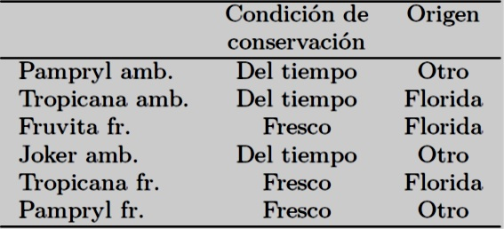

```{r setup, include=FALSE}
library(learnr)
library(FactoMineR)
setwd("~/Documents/maestria-pucp/2019-2/tecnicas-multivariadas/clase-8")
naranja <- read.table("naranja.csv",header=TRUE, sep=",", dec=".", row.names=1)
res.pca <- PCA(naranja,quanti.sup=8:14,quali.sup=15:16)
gastos <- read.table("gastos.csv",
header=TRUE, sep=";", row.names=1)
res.pca2 <- PCA(gastos,ind.sup=8:18,quanti.sup=27:30)
usair.dat<-source("usair.dat")$value
attach(usair.dat)
usair.dat[,2]<- -usair.dat[,2]
names(usair.dat)=c("SO2","Temp", "Manuf","Pop","Wind","Precip","Days")
S=cor(usair.dat[,-1])
usair.pc<-princomp(usair.dat[,-1],cor=TRUE,fix_sign = FALSE)

```

## *Ejemplo 1*

Estos datos se han obtenido en el ámbito de trabajos de estudiantes del Agrocampus. Un jurado integrado por estudiantes evaluó los seis jugos de naranja según siete variables sensoriales (intensidad del olor, tipo de olor, carácter pulposo, intensidad del sabor, carácter ácido, carácter amargo, carácter azucarado). Los promedios de las evaluaciones del jurado conforman el conjunto de datos.

> De modo más general, nos preguntamos si existen unos grupos de jugos de naranja con
perfiles similares, por ejemplo, de dimensiones sensoriales que pueden oponer jugos extremos
a jugos intermedios.

Primero cargamos el paquete `FactoMineR` y luego importamos los datos precisando que el nombre de los individuos está en la primera columna (`row.names=1`)

```
library(FactoMineR)
naranja <- read.table(naranja.csv",header=TRUE, sep=";", dec=".", row.names=1)
```

```{r code1, exercise=TRUE} 
naranja
```

Podemos apreciar que la matriz de correlación reagrupa los 21 coeficientes de correlación. Se pueden reagrupar las variables muy correlacionades por paquetes pero, incluso para este número reducido de variables, esta reagrupación es
fastidiosa.

```{r code2, exercise=TRUE} 
cor(naranja[,1:7])
```

El ACP se obtiene precisando que aquí las variables de 8 a 14 son cuantitativas suplementarias y las variables 15 y 16 son cualitativas suplementarias:

```
res.pca <- PCA(naranja,quanti.sup=8:14,quali.sup=15:16)
```

```{r code3, exercise=TRUE} 
 
plot(res.pca, invisible="quali")
```

El principal eje de variabilidad entre los zumos de naranja, opone Tropicana fresco y Pampryl
ambiente. El segundo componente, el que más opone los zumos de naranja una vez el principal eje de
variabilidad retirado, opone Tropicana ambiente y Pampryl fresco.

```{r code4, exercise=TRUE} 
round(res.pca$var$coord[,1:2],2)
```

* Los resultados muestran los coeficientes de correlación entre cada una de las variables y los dos primeros componentes principales (las coordenadas de los individuos sobre los dos primeros ejes).

**Interpretación del gráfico y las correlaciones de las variables a los componentes**

* El primer componente está muy correlacionado positivamente con las variables tipo olor y azucarado y
muy correlacionada negativamente con las variables amargo y ácido.

* Así, Tropicana fresco, que tiene la coordenada más fuerte en el eje 1, tiene valores fuertes para el tipo de olor y el azucarado y valores débiles para las variables ácido y amargo.

* El segundo eje puede caracterizarse por las variables intensidad olor y pulposo

```{r figdatable, echo = TRUE, out.width = "100%", fig.align='center'}

```

* Para facilitar la lectura de estos resultados, particularmente cuando el número de variables
es elevado, representamos cada variable sobre un gráfico a partir de sus coeficientes de
correlación con el componente 1 y componente 2 que utilizamos como coordenadas.

* El principal eje de variabilidad opone los zumos de naranja percibidos como ácido-amargo, poco azucarados y poco típicos a los zumos de naranja percibidos
como azucarados, típicos, poco ácidos y poco amargos.


 **Observación** 
 
> La representación de una variable está dentro de un círculo de radio 1. Recordemos que los componetes 1 y 2 por construcción son ortogonales (coeficiente de correlación igual a 0) y que una variable no puede estar vinculada fuertemente y simultáneamente a dos ejes ortogonales. 

```{r code5, exercise=TRUE} 
 
plot(res.pca,choix="var",invisible="quanti")
```

**Porcentaje de la inercia asociado a un eje**
```{r code6, exercise=TRUE} 
round(res.pca$eig,2)
```

Como una medida de la calidad de representación de datos, diremos que el primer eje expresa el 67.77% de la variabilidad de los datos. El segundo eje expresa el 19.05% de la variabilidad de los datos. En total los dos primeros ejes expresan juntos el 86.81% de la varibilidad de los datos.

**Contribución de un individuo o de una variable en la construcción de un eje**
```{r code7, exercise=TRUE} 
round(res.pca$ind$contrib[,1:2],2)
round(res.pca$var$contrib[,1:2],2)
```

Cuando un individuo contribuye mucho (i.e., mucho más que otros) en la construcción de un eje factorial (por ejemplo Tropicana ambiente y Pampryl fresco, para el segundo eje), es frecuente que los resultados de un nuevo ACP construido sin este individuo cambien de modo sustancial: los principales factores de variabilidad pueden cambiar y aparecer nuevas oposiciones entre individuos.
Del mismo modo, obtenemos la contribución de cada variable en la construcción del ejes.


**Elementos suplementarios**

* Por definición, un elemento activo contribuye en la construcción de los ejes factoriales, contrariamente a un elemento suplementario. Así, la inercia de la nube de individuos se calcula teniendo como base los individuos activos en un espacio generado por las únicas variables activas. 

* Del mismo modo, la inercia de la nube de variables, en el espacio generado por los únicos individuos activos, se calcula teniendo como base las variables activas. 

* Los elementos suplementarios permiten ilustrar los ejes factoriales, de ahí su nombre de elementos ilustrativos. Al contrario de los elementos activos, que deben ser homogéneos, podemos introducir, de manera ilustrativa, elementos disparatados y numerosos.

*Representación de variables cuantitativas suplementarias*

La siguiente tabla muestra las variables cuantitativas suplementarias del conjunto de datos de los zumos de naranja:

```{r figdatable2, echo = TRUE, out.width = "100%", fig.align='center'}
knitr::include_graphics("images/complemento.jpg")
```

* Por definición, una variable cuantitativa suplementaria no interviene en el cálculo de las
distancias entre individuos. La representamos de la misma manera que las variables activas
como ayuda a la interpretación de la nube de individuos.

* En el ejemplo, disponemos además de los descriptores sensoriales, de las variables fisicoquímicas. Sin embargo, el punto de vista adoptado sobre los datos no cambia, es decir, describir los zumos de naranja a partir del único perfil sensorial. Esta problemática puede ser enriquecida uniendo las dimensiones sensoriales a las variables fisico-químicas.

```{r code8, exercise=TRUE} 
 
plot(res.pca,choix="var")
```

* El círculo de correlaciones permite una representación conjunta de las variables activas y suplementarias. 

* Como ya habiamos visto, el principal eje de variabilidad opone los zumos de naranja percibidos como ácido-amargo, poco azucarados y poco típicos a los zumos de naranja percibidos
como azucarados, típicos, poco ácidos y poco amargos. 

* El análisis de esta percepción sensorial es reforzado por las variables pH y sacarosa. En efecto, estas dos variables son correlacionadas positivamente al primer eje y se sitúan al lado de los zumos de naranja percibidos como azucarados y poco ácidos (un índice de pH elevado indica una acidez débil). 
* También encontramos la reacción llamada **de inversión (o de hidrólisis) de sacarosa**, la sacarosa se descompone en glucosa y fructosa en un medio ácido (los zumos de naranja ácidos contienen más fructosa y glucosa y menos sacarosa que la media).


 **Observación** 
 
> Cuando utilizamos el ACP con un fin exploratorio de los datos antes de realizar una regresión
múltiple, se aconseja escoger las variables explicativas del modelo de regresión como variables
activas del ACP y proyectar en suplementario la variable que hay que explicar. Esto da una
idea de las relaciones entre variables explicativas y de la necesidad a seleccionar las variables
explicativas en el modelo. Esto también da una idea sobre la calidad de la regresión : si la
variable que hay que explicar está bien proyectada, el modelo se ajusta bien los datos.

*Representación de variables cualitativas suplementarias*

```{r figdatable3, echo = TRUE, out.width = "80%", fig.align='center'}

```

* Las variables activas de un ACP son necesariamente cuantitativas pero es posible utilizar la información procedente de variables cualitativas a título ilustrativo (suplementario), es decir, que no se utilizan en el cálculo de las distancias entre individuos.

* Las variables cualitativas no pueden representarse de la misma manera que las variables cuantitativas suplementarias ya que es imposible calcular la correlación entre una variable cualitativa y un componente. La información de una variable cualitativa se sitúa a nivel de las modalidades.

* Es natural representar una modalidad en el baricentro del conjunto de los individuos que la poseen. Así, como respuesta a la proyección sobre el plano factorial, estas modalidades se quedan en el baricentro de los individuos en su representación plana. De esta manera, una modalidad puede considerarse como el individuo medio obtenido a partir del conjunto de los individuos que la poseen. En este sentido, la representamos sobre el gráfico de los individuos.


```{r code9, exercise=TRUE} 
 
plot(res.pca)
```

En el ejemplo, podemos introducir la variable condición de conservación que toma las modalidades ambiente y fresco así como la variable origen de los zumos de frutas que toma las modalidades Florida y Otro. Parece haber una percepción sensorial diferente entre productos según su embalaje (aunque todos ellos hubieran sido degustados a la misma temperatura).

```{r figdatable4, echo = TRUE, out.width = "80%", fig.align='center'}

```

**Descripción automática de los ejes**

* Los ejes obtenidos por el análisis factorial pueden ser descritos de modo automático por el conjunto de las variables, ya sean cuantitativas o cualitativas, activas o suplementarias. Para una variable cuantitativa, el principio es el mismo, sea la variable activa o suplementaria.

* Calculamos el coeficiente de correlación entre las coordenadas de los individuos sobre cada eje y cada una de las variables. 

* Clasificamos las variables por su coeficiente de correlación, del más elevado al más débil y conservamos las variables que tienen los coeficientes más altos (en valor absoluto).

* La función dimdesc proporciona la descripción automática de las dimensiones de las variables
cuantitativas y cualitativas.

```{r code10, exercise=TRUE} 
dimdesc(res.pca)
```

* Las variables que más caracterizan el eje 1 son el tipo de olor, el carácter azucarado, el carácter amargo y el carácter ácido.

* El primer eje también se caracteriza por la variable cualitativa Origen ya que el test de correlación es significativamente diferente de 0.

* Los zumos de naranja de Florida tienen coordenadas significativamente más elevadas que la media en el primer eje mientras que los zumos de naranja de otras procedencias tienen coordenadas inferiores a la media.

## *Ejemplo 2*

* El juego de datos procede de una encuesta llamada «presupuesto por familia» llevada por el INSEE (Instituto Nacional de Estadística y Estudios Económicos) en 2006 (http://www.insee.fr/fr/bases-de-donnees/). Estas encuestas permiten conocer
el peso de los grandes sectores de consumo en el presupuesto de los hogares. 

* El conjunto de datos contiene  el reparto del gasto anual medio (en Euros) por el cuidado del hogar según la edad de la persona de referencia. Una fila corresponde a un grupo de edad, una columna a una variable que corresponde a una sección de gasto 

* Disponemos de 30 variables cuantitativas (26 corresponden a diferentes rúbricas, tres corresponden a totales parciales y uno al gasto total).

* Disponemos además del reparto del gasto anual para el conjunto de la población francesa así como del reparto de los gastos en función de la renta del hogar. 

* Las rentas son reagrupadas por decilo : El decilo 1 corresponde al 10 % de los hogares que tiene las rentas más débiles, el decilo 2 concierne a las personas que tienen las rentas entre 10 y 20 % más débiles... y el decilo 10 corresponde al 10% que tienen las rentas más elevadas.

Para cargar el package FactoMineR e importar el juego de datos, realizamos los siguientes comandos:

```
library(FactoMineR)
gastos <- read.table("gastos.csv",header=TRUE, sep=";", row.names=1)
```
```{r code11, exercise=TRUE} 
gastos
```

* Nos interesamos aquí en la evolución del perfil de los gastos según la edad. Este objetivo bastante general puede declinarse según varias cuestiones. ¿Hay grupos de edad que tienen perfiles de gastos muy próximos?

* Podemos así obtener una tipología de los grupos de edad según los diferentes puestos de gastos; la tipología siendo construida de modo que dos grupos
de edad son tan próximos que tienen perfiles de gastos similares. ¿Hay puestos de gastos que evolucionan del mismo modo según la edad?

* Además, ¿podemos construir indicadores sintéticos que permiten resumir la evolución de los perfiles de gastos? Podemos interesarnos por los indicadores a priori como los totales parciales o el gasto total, pero el análisis permite
construir indicadores a posteriori (los factores del ACP) que podremos intentar unir a otros indicadores (por ejemplo, la renta media).

* Ambos resultados, el primero sobre los individuos y el segundo sobre las variables, están confrontados para describir la tipología de los individuos a partir de las variables y recíprocamente.

* También podremos unir la tipología de los individuos con las variables cuantitativas que no participaron a la construcción de las distancias interindividuales (las variables que corresponden a los totales) así como los individuos suplementarios (los decilos de renta).

**Estandarización o no estandarización de variables**
```{r code12, exercise=TRUE} 
variab <- cbind(apply(gastos[1:7,],2,mean),
apply(gastos[1:7,],2,sd)*sqrt(6/7),
apply(gastos[1:7,],2,sd)*sqrt(6/7)/apply(gastos[1:7,],2,mean))
colnames(variab) <- c("Media","D.E","CV")
variab
```

* Las diferentes rúbricas son medidas en las mismas unidades (en euros), entonces es posible estandarizarlas o no (cuando las variables están en unidades diferentes, es indispensable estandarizarlas).

* Si se estandardizan las variables, su influencia en el cálculo de las distancias
entre grupos de edad es equilibrado desde el punto de vista de su desviación estándar respectiva: sin estandarización, la variable *Fuera de campos consumo final*, con una desviación estándar de 2961.62, tendría una influencia más de 100 veces superior a la de la variable café.té.cacao (desviación estándar de 26.77).

* Esta elección de estandardizar o no, tiene pues un impacto importante
sobre los resultados del análisis. La tabla siguiente muestra que las desviaciones estándar son globalmente proporcionales a la media (el coeficiente de variación es muy similar de una variable a otra).

* Así, concediendo más peso a las variables que tienen una desviación estándar
fuerte, concedemos más peso a las variables que corresponden a los puestos importantes de gasto. Este punto de vista puede ser adoptado en una perspectiva «económica». En una perspectiva más bien «sociológica», un puesto de gasto débil puede merecer la atención. Escogemos aquí este segundo punto de vista estandarizando.

**Elección del número de dimensiones a estudiar**

```
res.pca2 <- PCA(gastos,ind.sup=8:18,quanti.sup=27:30)

```
```{r code13, exercise=TRUE} 
round(res.pca2$eig,2)
```

* La inercia de los ejes factoriales indica por una parte, si las variables son estructuradas (presencia de correlaciones entre variables) y por otra parte, sugiere el número de componentes principales por interpretar.

* El objeto `res.pca$eig` contiene el valor propio (la inercia o la varianza explicada) asociado a cada uno de los ejes, el porcentaje de inercia que representa en el análisis así como la acumulación de estos porcentajes.

Podemos visualizar estos valores propios con la ayuda de un diagrama en barras utilizando el siguiente comando:

```{r code14, exercise=TRUE} 
 
barplot(res.pca2$eig[,1], main="Valores propios", names.arg=paste("dim",1:nrow(res.pca2$eig)))
```

Los dos primeros ejes expresan 93.03% de la inercia total, en otros términos, el 93.03% de la variabilidad total de la nube de los individuos (o de las variables) está representado por el primer plano. Este porcentaje es extremadamente importante y el primer plano representa la variabilidad contenida en el conjunto del juego activo de datos.

**Estudio de la nube de los individuos activos**

```{r code15, exercise=TRUE} 
 
plot.PCA(res.pca2, choix="ind", invisible="ind.sup")
```

* Este gráfico de los individuos presenta una disposición remarcable: el primer
eje opone los grupos de edad extremos con los grupos de edad medios. 

* El segundo eje ordena los grupos de edad del más alto al más bajo.

*Contribuciones de cada individuo*

```{r code16, exercise=TRUE} 
round(res.pca2$ind$contrib[,1:3],2)
```

**Estudio de la nube de las variables**
```{r code17, exercise=TRUE} 
 
plot.PCA(res.pca2, choix="var", invisible="quanti.sup")
```

```{r code18, exercise=TRUE} 
round(cbind(res.pca2$var$coord[,1:3],res.pca2$var$contrib[,1:3]),2)
```

* Se puede apreciar una correlación positiva entre el primer componente principal
y todas las variables excepto tabaco, vivienda agua gas electricidad y enseñanza.

* Así, este eje opone grupos de edad que consumen poco (grupos que tienen coordenadas negativas en el primer eje) con grupos de edad que consumen mucho (en cualquier tipo de gastos).

* Todas las variables están bien representadas en el plano 1-2, excepto la variable enseñanza.

* Ciertos gastos están fuertemente correlacionados entre ellos: pan.cereales y leche.quesos.huevos están correlacionados positivamente (ciertos grupos de edad gastan poco en estos dos puestos de gastos y otros gastan mucho). La variable vivienda.agua.gas.electricidad es ortogonal a estas dos variables y por consecuencia está muy poco correlacionada con ellas.

Las variables suplementarias son útiles aquí para simplificar la lectura del gráfico de las variables. En efecto, en este ejemplo, las variables suplementarias son variables totales que resumen varias variables. El gráfico de las variables suplementarias es obtenido por:

```{r code19, exercise=TRUE} 
 
plot.PCA(res.pca2, choix="var", invisible="var")
```

```{r code20, exercise=TRUE} 
round(res.pca2$quanti.sup$coord[,1:3],2)
```

**Descripción automática de las dimensiones**

Recordemos que es posible obtener una descripción automática de los ejes factoriales por las variables activas o suplementarias con la ayuda de la función dimdesc:

```{r code21, exercise=TRUE} 
dimdesc(res.pca2)
```

* Esta función es más útil cuantas más variables hayan y por lo tanto el gráfico de las variables esté cargado. 

* Vemos aquí que el primer eje está muy vinculado a la variable *total_alimentación* (coeficiente de correlación de 0.996) y a la variable *fuera_campo_consumo_final*, etc.

* El segundo eje está muy vinculado a las variables *vivienda agua gas electricidad* y *tabaco*.

```{r code22, exercise=TRUE} 
 
plot.PCA(res.pca2, choix="ind")
```

* El individuo Conjunto está en el centro del gráfico, lo que era de esperar ya que corresponde al perfil Francia entera.

* A lo largo del primer eje, todos los decilos sin excepción están ordenados del más pequeño al más elevado. Así, el primer eje opone las rentas más débiles a las rentas más elevadas. 

* Todos los decilos son repartidos de modo homogéneo, excepto el último decilo que es más extremo que lo esperado : hay un salto entre las rentas muy elevadas (decilo 9) y las rentas más elevadas (decilo 10) en el consumo. Esta distancia más grande entre los perfiles de gastos de los decilos 9 y 10 corresponde sin duda a una separación más grande de renta.

**Plano 2-3**

Podemos también interesarnos por la dimensión siguiente y construir el gráfico 2-3 de individuos

```{r code23, exercise=TRUE} 
 
plot(res.pca2, choix="ind", invisible="ind.sup", axes=2:3)
```

```{r code24, exercise=TRUE} 
 
plot(res.pca2, choix="var", invisible="quanti.sup", axes=2:3)
```

* El eje 3 está esencialmente vinculado a la variable *enseñanza* (correlación positiva) y a un menor grado a la variable *otros_productos_alimenticios* (correlación negativa). 

```{r code25, exercise=TRUE} 
round(res.pca2$ind$contrib[,1:3],2)
round(res.pca2$var$coord[,1:3],2)
```


* Principalmente opone el tramo de edad 25-34 años a los tramos menos de 25 años y 45-54 años (suma de las contribuciones al eje 3 de estos tres puntos: 97.91%). 

* Los grupos de edad menos de 25 años y 45-54 años gastan más que los otros grupos de edad en enseñanza. Podemos suponer que son o bien estudiantes o bien padres de estudiantes o de niños escolarizados. 

* Recíprocamente, podemos suponer que el tramo de edad 25-34 años contiene pocos
o ningun estudiante y/o padre. 

* Podremos concluir que este tercer eje es interpretable; no obstante, el débil valor propio recuerda que se trata de una dimensión de variabilidad de
débil importancia comparada con la de los ejes precedentes (lo que concierne prácticamente a una sola variable).

## *Ejemplo 3*

Se dispone de una muestra de 41 ciudades de USA en las que se midieron diferentes
variables relacionadas con la contaminación atmosférica.

Las variables son:

- Contenido en SO2
- Temperatura anual en grados F.
- Número de empresas mayores de 20 trabajadores.
- Población (en miles de habitantes).
- Velocidad media del viento.
- Precipitación anual media.
- Días lluviosos al año.

En principio interesa investigar la relación entre la concentración en SO2 y el resto de variables, aunque para eliminar relaciones entre las variables se emplea un análisis de componentes principales.

Se realiza un análisis de componente principales sobre todas las variables salvo SO2.

Se obtienen los componentes principales a partir de la matriz de correlaciones para emplear las mismas escalas en todas las variables.

```
usair.dat<-source("usair.dat")$value
attach(usair.dat)
usair.dat[,2]<- -usair.dat[,2]
names(usair.dat)=c("SO2","Temp", "Manuf","Pop","Wind","Precip","Days")
```
```{r code26, exercise=TRUE} 
usair.dat
cor(usair.dat[,-1])
usair.pc<-princomp(usair.dat[,-1],cor=TRUE,fix_sign = FALSE)
summary(usair.pc,loadings=TRUE)
```

Se puede calcular también de la siguiente forma

* La varianza está dada por los autovalores

* Los loadings por los autovectores (se usa para construir los componentes)

```{r code27, exercise=TRUE} 
S=cor(usair.dat[,-1])
eigen(S)
```

* Las desviaciones estandar

* La proporción de las varianzas

* Las varianzas acumuladas


```{r code28, exercise=TRUE} 
sqrt(eigen(S)$values)
eigen(S)$values/sum(eigen(S)$values)
cumsum(eigen(S)$values/sum(eigen(S)$values))
```

```{r code29, exercise=TRUE} 
usair.pc<-princomp(usair.dat[,-1],cor=TRUE,fix_sign = FALSE)
summary(usair.pc,loadings=TRUE)
```

* Los primeros tres componentes tienen todos varianzas (autovalores) mayores que 1 y entre los tres recogen el 85% de la varianza de las variables originales.

* calculamos las correlaciones de las variables iniciales con los componentes principales

```{r code30, exercise=TRUE} 
usair.pc$loadings%*%diag(usair.pc$sdev)

```

* El primer componente se le podría etiquetar como calidad de vida con valores negativos altos en empresas y población indicando un entorno relativamente pobre. 

* El segundo componente se puede etiquetar como tiempo húmedo, y tiene pesos altos en las variables precipitaciones y días. 

* El tercer componente se podría etiquetar como tipo de clima y está relacionado con la temperatura y la cantidad de lluvia.

```{r code31, exercise=TRUE} 
 
par(pty="s")
plot(usair.pc$scores[,1],usair.pc$scores[,2],
     ylim=range(usair.pc$scores[,1]),
     xlab="PC1",ylab="PC2",type="n",lwd=2)
text(usair.pc$scores[,1],usair.pc$scores[,2],
     labels=abbreviate(row.names(usair.dat)),cex=0.7,lwd=2)
```
Phoenix aparece como la ciudad con más calidad de vida, y Buffalo parece la más húmeda.

```{r code32, exercise=TRUE} 
 
par(pty="s")
plot(usair.pc$scores[,1],usair.pc$scores[,3],
     ylim=range(usair.pc$scores[,1]),
     xlab="PC1",ylab="PC3",type="n",lwd=2)
text(usair.pc$scores[,1],usair.pc$scores[,3],
     labels=abbreviate(row.names(usair.dat)),cex=0.7,lwd=2)
```

```{r code34, exercise=TRUE} 
 
par(pty="s")
plot(usair.pc$scores[,2],usair.pc$scores[,3],
     ylim=range(usair.pc$scores[,2]),
     xlab="PC2",ylab="PC3",type="n",lwd=2)
text(usair.pc$scores[,2],usair.pc$scores[,3],
     labels=abbreviate(row.names(usair.dat)),cex=0.7,lwd=2)
```

* Se observa que la ciudad de Chicago es un outlier y también, en menor medida, las ciudades de Phoenix y Philadelphia.

* Aunque no se encontrasen etiquetas claras para los componentes, siempre es interesante calcular componentes principales para descubrir si los datos se encuentran en una dimensión menor.

* Hacemos un análisis de regresión de la variable SO2 sobre los tres factores: claramente la cantidad de SO2 se explica mediante el primer componente de calidad de vida (relacionado con el entorno humano y el clima) que cuando empeora aumenta, a su vez, la contaminación.

```{r code33, exercise=TRUE} 
summary(lm(SO2~usair.pc$scores[,1]+usair.pc$scores[,2]+
             usair.pc$scores[,3]))
```


