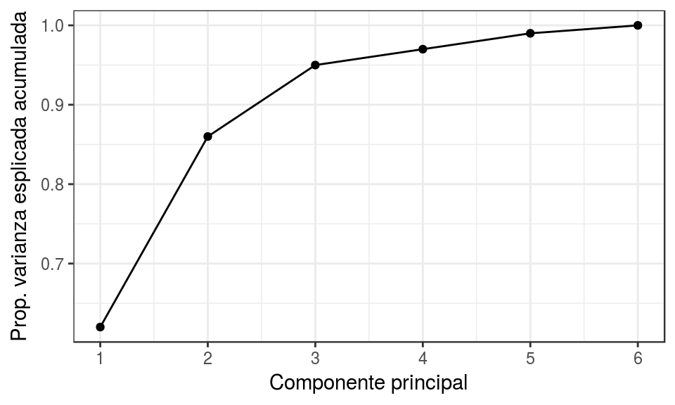

```{r setup, include=FALSE, echo = FALSE}
knitr::opts_chunk$set(echo = TRUE)
rm(list = ls())
```

 

```{r}
pacman::p_load(Hmisc,readxl,lubridate,ggplot2,faraway,pls,readr,dplyr,Rtsne) 
```

## Análisis de Componentes Principales 

  - Principal Component Analysis (PCA) es un método estadístico que permite simplificar la complejidad de espacios muestrales con muchas dimensiones a la vez que conserva su información. Supóngase que existe una muestra con \(n\) individuos cada uno con \(p\) variables (\(X_1\), \(X_2\), ..., \(X_p\)), es decir, el espacio muestral tiene \(p\) dimensiones. PCA permite encontrar un número de factores subyacentes \((z < p)\) que explican aproximadamente lo mismo que las \(p\) variables originales. Donde antes se necesitaban \(p\) valores para caracterizar a cada individuo, ahora bastan \(z\) valores. Cada una de estas \(z\) nuevas variables recibe el nombre de componente principal.

  - Principal Component Analysis pertenece a la familia de técnicas conocida como unsupervised learning. Los métodos de supervised learning tienen el objetivo de predecir una variable respuesta \(Y\) a partir de una serie de predictores. Para ello, se dispone de p características (\(X_1\), \(X_2\) … \(X_p\)) y de la variable respuesta \(Y\) medidas en $n$ observaciones. En el caso de unsupervised learning, la variable respuesta \(Y\) no se tiene en cuenta ya que el objetivo no es predecir \(Y\) sino extraer información empleando los predictores, por ejemplo, para identificar subgrupos. El principal problema al que se enfrentan los métodos de unsupervised learning es la dificultad para validar los resultados dado que no se dispone de una variable respuesta que permita contrastarlos.
  
  - El método de PCA permite por lo tanto “condensar” la información aportada por múltiples variables en solo unas pocas componentes. Esto lo convierte en un método muy útil de aplicar previa utilización de otras técnicas estadísticas tales como regresión, clustering… Aun así no hay que olvidar que sigue siendo necesario disponer del valor de las variables originales para calcular las componentes. 


**Cálculo de las componentes principales**

  - Buscamos una combinación lineal de columnas de la matriz $\mathbf{X}$ con varianza máxima.
  
  - Cada componente principal (\(Z_i\)) se obtiene por combinación lineal de las variables originales. Se pueden entender como nuevas variables obtenidas al combinar de una determinada forma las variables originales. La primera componente principal de un grupo de variables (\(X_1\), \(X_2\), …, \(X_p\)) es la combinación lineal normalizada de dichas variables que tiene mayor varianza: \[Z_1 = \phi_{11} X_1 + \phi_{21}X_2+ ... + \phi_{p1}X_p\]

Que la combinación lineal sea normalizada ($\mathbf{\phi}$ es un vector unitario, es decir cumple la condición que $|\mathbf{\widehat{\phi}}|=\left\|\frac{\mathbf{\phi}}{|\mathbf{\phi}|}\right\|=1$) implica que:

\[\displaystyle\sum_{j=1}^p \phi^{2}_{j1}= 1\]

Los términos \(\phi_{11}\), …, \(\phi_{1p}\) reciben en el nombre de loadings y son los que definen a la componente. \(\phi_{11}\) es el loading de la variable \(X_1\) de la primera componente principal. Los loadings pueden interpretarse como el peso/importancia que tiene cada variable en cada componente y, por lo tanto, ayudan a conocer que tipo de información recoge cada una de las componentes.

Dado un set de datos \(X\) con n observaciones y p variables, el proceso a seguir para calcular la primera componente principal es:

  - Centralización de las variables: se resta a cada valor la media de la variable a la que pertenece. Con esto se consigue que todas las variables tengan media cero.

  - Se resuelve un problema de optimización para encontrar el valor de los loadings con los que se maximiza la varianza. Una forma de resolver esta optimización es mediante el cálculo de eigenvector-eigenvalue de la matriz de covarianzas.

Una vez calculada la primera componente (\(Z_1\)) se calcula la segunda (\(Z_2\)) repitiendo el mismo proceso, pero añadiendo la condición de que la combinación lineal no pude estar correlacionada con la primera componente. Esto equivale a decir que \(Z_1\) y \(Z_2\) tienen que ser perpendiculares. EL proceso se repite de forma iterativa hasta calcular todas las posibles componentes (min(n-1, p)) o hasta que se decida detener el proceso. El orden de importancia de las componentes viene dado por la magnitud del eigenvalue asociado a cada eigenvector. 

**Escalado de las variables**

  - El proceso de PCA identifica aquellas direcciones en las que la varianza es mayor. Como la varianza de una variable se mide en su misma escala elevada al cuadrado, si antes de calcular las componentes no se estandarizan todas las variables para que tengan media 0 y desviación estándar 1, aquellas variables cuya escala sea mayor dominarán al resto. De ahí que sea recomendable estandarizar siempre los datos. 

**Influencia de outliers**

  - Al trabajar con varianzas, el método PCA es altamente sensible a outliers, por lo que es altamente recomendable estudiar si los hay. La detección de valores atípicos con respecto a una determinada dimensión es algo relativamente sencillo de hacer mediante comprobaciones gráficas.     - Sin embargo, cuando se trata con múltiples dimensiones el proceso se complica. Por ejemplo, considérese un hombre que mide 2 metros y pesa 50 kg. Ninguno de los dos valores es atípico de forma individual, pero en conjunto se trataría de un caso muy excepcional. La distancia de Mahalanobis es una medida de distancia entre un punto y la media que se ajusta en función de la correlación entre dimensiones y que permite encontrar potenciales outliers en distribuciones multivariante. 

**Proporción de varianza explicada**

Una de las preguntas más frecuentes que surge tras realizar un PCA es: ¿Cuánta información presente en el set de datos original se pierde al proyectar las observaciones en un espacio de menor dimensión? o lo que es lo mismo ¿Cuanta información es capaz de capturar cada una de las componentes principales obtenidas? Para contestar a estas preguntas se recurre a la proporción de varianza explicada por cada componente principal.

Asumiendo que las variables se han normalizado para tener media cero, la varianza total presente en el set de datos se define como

\[\displaystyle\sum_{j=1}^p Var(X_j) = \displaystyle\sum_{j=1}^p \frac{1}{n} \displaystyle\sum_{i=1}^n x^{2}_{ij}\]

y la varianza explicada por la componente $m$ es

\[\frac{1}{n} \sum_{i=1}^n z^{2}_{im} = \frac{1}{n} \sum_{i=1}^n \left( \sum_{j=1}^p \phi_{jm}x_{ij} \right)^2\]

Por lo tanto, la proporción de varianza explicada acumulada por la componente $m$ viene dada por el ratio

\[\frac{\sum_{i=1}^n \left( \sum_{j=1}^p \phi_{jm}x_{ij} \right)^2} {\sum_{j=1}^p \sum_{i=1}^n x^{2}_{ij}} \]       

Tanto la proporción de varianza explicada como la proporción de varianza explicada acumulada son dos valores de gran utilidad a la hora de decidir el número de componentes principales a utilizar en los análisis posteriores. Si se calculan todas las componentes principales de un set de datos, entonces, aunque transformada, se está almacenando toda la información presente en los datos originales. El sumatorio de la proporción de varianza explicada acumulada de todas las componentes es siempre 1. 

**Número óptimo de componentes principales**

  - Por lo general, dada una matriz de datos de dimensiones $n \times p$, el número de componentes principales que se pueden calcular es como máximo de $n-1$ o $p$ (el menor de los dos valores es el limitante). Sin embargo, siendo el objetivo del PCA reducir la dimensionalidad, suelen ser de interés utilizar el número mínimo de componentes que resultan suficientes para explicar los datos. 
  - No existe una respuesta o método único que permita identificar cual es el número óptimo de componentes principales a utilizar. Una forma de proceder muy extendida consiste en evaluar la proporción de varianza explicada acumulada y seleccionar el número de componentes mínimo a partir del cual el incremento deja de ser sustancial.

```{r fig1, echo = TRUE, out.width = "70%"}

```


**Ejemplo cálculo eigenvectors y eigenvalues**

El siguiente es un ejemplo que muestra cómo se pueden calcular las componentes principales de un set de datos mediante la identificación de eigenvectors y eigenvalues por el método de covarianza. Con el objetivo de ser un ejemplo sencillo, el set de datos empleado tiene dos dimensiones (variables). La mayoría de programas de análisis, entre ellos R, disponen de funciones que devuelven directamente el valor de las componentes principales.

```{r}
datos <- data.frame(X1 = c(2.5, 0.5, 2.2, 1.9, 3.1, 2.3, 2, 1, 1.5, 1.1),
                    X2 = c(2.4, 0.7, 2.9, 2.2, 3.0, 2.7, 1.6, 1.1, 1.6, 0.9))
datos
```

En primer lugar se resta a cada valor la media de la variable a la que pertenece. Con esto se consigue centralizar las variables y que su media sea 0.

```{r code2, exercise=TRUE}
datos_centrados <- datos
datos_centrados$X1 <- datos$X1 - mean(datos$X1)
datos_centrados$X2 <- datos$X2 - mean(datos$X2)
datos_centrados
```

A continuación se calcula la matriz de correlaciones entre cada par de variables. Como en este ejemplo hay dos variables, el resultado es una matriz simétrica 2x2.

```{r}
matriz_cov <- cov(datos_centrados)
matriz_cov
```

Dado que la matriz de covarianzas es cuadrada, se pueden obtener sus correspondientes eigenvectors y eigenvalues. La función `eigen()` calcula ambos y los almacena en una lista bajo el nombre de vectors y values. Los eigenvalues se devuelven en orden decreciente y los eigenvectors (estandarizados) se ordenan de izquierda a derecha acorde a sus eigenvalues asociados.

```{r}
eigen <- eigen(matriz_cov)
eigen$values
eigen$vectors
```

Los eigenvectors ordenados de mayor a menor eigenvalues se corresponden con las componentes principales. 

Una vez obtenidos los eigenvectors (componentes principales) se calcula el valor que toma cada componente para cada observación en función de las variables originales (principal component scores). Para ello, simplemente se tienen que multiplicar los eigenvectors transpuestos por los datos originales centrados y también transpuestos.

```{r}
t_eigenvectors <- t(eigen$vectors)
t_eigenvectors

t_datos_centrados <- t(datos_centrados)
t_datos_centrados
```

```{r}
# Producto matricial
pc_scores <- t_eigenvectors %*% t_datos_centrados
rownames(pc_scores) <- c("PC1", "PC2")

# Se vuelve a transponer para que los datos estén en modo tabla
t(pc_scores)
```

Cuando se calculan y conservan todos los eigenvectors (componentes principales), es posible recuperar de nuevo los valores iniciales. Solo es necesario invertir el proceso:

```{r}
datos_recuperados      <- t(eigen$vectors %*% pc_scores)
datos_recuperados[, 1] <- datos_recuperados[, 1] + mean(datos$X1)
datos_recuperados[, 2] <- datos_recuperados[, 2] + mean(datos$X2)

datos_recuperados


#Datos originales
datos
```

**Ejemplo cálculo directo de PCA con R**

El set de datos `USArrests` del paquete básico de R contiene el porcentaje de asaltos (Assault), asesinatos (Murder) y secuestros (Rape) por cada 100000 habitantes para cada uno de los 50 estados de USA (1973). Además, también incluye el porcentaje de la población de cada estado que vive en zonas rurales (UrbanPoP).

```{r}
data("USArrests")
head(USArrests)
```

El promedio de los datos muestra que hay tres veces más secuestros que asesinatos y 8 veces más asaltos que secuestros.

```{r}
apply(X = USArrests, MARGIN = 2, FUN = mean)
```

La varianza es muy distinta entre las variables, en el caso de Assault, la varianza es varios órdenes de magnitud superior al resto.

```{r}
apply(X = USArrests, MARGIN = 2, FUN = var)
```

Si no se estandarizan las variables para que tengan media cero y desviación estándar 1 antes de realizar el estudio PCA, la variable Assault dominará la mayoría de las componentes principales.

La función `prcomp()` es una de las múltiples funciones en R que realizan PCA. Por defecto,  `prcomp()` centra las variables para que tengan media cero, pero si se quiere además que su desviación estándar sea de uno, hay que indicar `scale = TRUE`.

```{r}
pca <- prcomp(USArrests, scale = TRUE)
names(pca)
```

Los elementos center y scale almacenados en el objeto pca contienen la media y desviación típica de las variables previa estandarización (en la escala original).

```{r}
pca$center
pca$scale
```

`rotation` contiene el valor de los loadings $\phi$ para cada componente (eigenvector). El número máximo de componentes principales se corresponde con el $mínimo(n-1,p)$, que en este caso es $min(49,4)=4$.

```{r}
pca$rotation
```

Analizar con detalle el vector de loadings que forma cada componente puede ayudar a interpretar que tipo de información recoge cada una de ellas. Por ejemplo, la primera componente es el resultado de la siguiente combinación lineal de las variables originales:

$$PC1=−0.5358995 Murder−0.5831836 Assault−0.2781909 UrbanPop−0.5434321 Rape$$

Los pesos asignados en la primera componente a las variables *Assault*, *Murder* y *Rape* son aproximadamente iguales entre ellos y bastante superiores al asignado a *UrbanPoP*, esto significa que la primera componente recoge mayoritariamente la información correspondiente a los delitos. 

En la segunda componente, es la variable *UrbanPoP* la que tiene con diferencia mayor peso, por lo que se corresponde principalmente con el nivel de urbanización del estado. Si bien en este ejemplo la interpretación de las componentes es bastante clara, no en todos los casos ocurre lo mismo.

La función `prcomp()` calcula automáticamente el valor de las componentes principales para cada observación (principal component scores) multiplicando los datos por los vectores de loadings. El resultado se almacena en la matriz x.

```{r}
head(pca$x)

dim(pca$x)
```

Mediante la función `biplot()` se puede obtener una representación bidimensional de las dos primeras componentes. Es recomendable indicar el argumento `scale = 0` para que las flechas estén en la misma escala que las componentes.

```{r}
biplot(x = pca, scale = 0, cex = 0.6, col = c("blue4", "brown3"))
```

Una vez calculadas las componentes principales, se puede conocer la varianza explicada por cada una de ellas, la proporción respecto al total y la proporción de varianza acumulada.

```{r}
library(ggplot2)
pca$sdev^2

prop_varianza <- pca$sdev^2 / sum(pca$sdev^2)
prop_varianza
```

```{r}
ggplot(data = data.frame(prop_varianza, pc = 1:4),
       aes(x = pc, y = prop_varianza)) +
  geom_col(width = 0.3) +
  scale_y_continuous(limits = c(0,1)) +
  theme_bw() +
  labs(x = "Componente principal",
       y = "Prop. de varianza explicada")
```

```{r}
prop_varianza_acum <- cumsum(prop_varianza)
prop_varianza_acum
```

```{r}
ggplot(data = data.frame(prop_varianza_acum, pc = 1:4),
       aes(x = pc, y = prop_varianza_acum, group = 1)) +
  geom_point() +
  geom_line() +
  theme_bw() +
  labs(x = "Componente principal",
       y = "Prop. varianza explicada acumulada")
```

En este caso, la primera componente explica el 62% de la varianza observada en los datos y la segunda el 24.7%. Las dos últimas componentes no superan por separado el 1% de varianza explicada. Si se empleasen únicamente las dos primeras componentes se conseguiría explicar el 86.75% de la varianza observada. 


**PCR: PCA aplicado a regresión lineal**

El método *Principal Components Regression (PCR)* consiste en ajustar un modelo de regresión lineal por mínimos cuadrados empleando como predictores las componentes generadas a partir de un *Principal Component Analysis (PCA)*. De esta forma, con un número reducido de componentes se puede explicar la mayor parte de la varianza de los datos.

En los estudios observacionales, es frecuente disponer de un número elevado de variables que se pueden emplear como predictores. A pesar de ello, un alto número de predictores no implica necesariamente mucha información. Si las variables están correlacionadas entre ellas, la información que aportan es redundante y además viola la condición de no colinealidad necesaria en la regresión por mínimos cuadrados. 

Dado que el PCA es útil eliminando información redundante, si se emplean como predictores las componentes principales se puede mejorar el modelo de regresión. Es importante tener en cuenta que, si bien el *Principal Components Regression* reduce el número de predictores del modelo, no se puede considerar como un método de selección de variables ya que todas ellas se necesitan para el cálculo de las componentes. La identificación del número óptimo de componentes principales que se emplean como predictores en PCR puede identificarse por *cross validation*.

El método PCR no deja de ser un ajuste lineal por mínimos cuadrados que emplea componentes principales como predictores. 

**Ejemplo**

La cuantificación del contenido en grasa de la carne pude hacerse mediante técnicas de analítica química, sin embargo, este proceso es costoso en tiempo y recursos. Una posible alternativa para reducir costes y optimizar tiempo es emplear un espectrofotómetro (instrumento capaz de detectar la absorbancia que tiene un material a diferentes tipos de luz en función de sus características). 

Para comprobar su efectividad se mide el espectro de absorbancia de 100 longitudes de onda en 215 muestras de carne, cuyo contenido en grasa se obtiene también por análisis químico para poder comparar los resultados. El set de datos `meatspec` del paquete `faraway` contiene toda la información. 

```{r}
library(faraway)
data(meatspec)
dim(meatspec)
```

El set de datos contiene 101 columnas. Las 100 primeras, nombradas como $V_1, \ldots, V_{100}$ recogen el valor de absorbancia para cada una de las 100 longitudes de onda analizadas, y la columna `fat` el contenido en grasa medido por técnicas químicas.

Para poder evaluar la capacidad predictiva del modelo, se dividen las observaciones disponibles en dos grupos: uno de entrenamiento para ajustar el modelo (80% de los datos) y uno de test (20% de los datos).

```{r}
training <- meatspec[1:172, ]
test     <- meatspec[173:215, ]
```

En primer lugar se ajusta un modelo incluyendo todas las longitudes de onda como predictores.

```{r}
modelo <- lm(fat ~ ., data = training)
summary(modelo)
```

El valor \(R^2_{ajustado}\) obtenido es muy alto (0.9928) lo que indica que el modelo es capaz de predecir con gran exactitud el contenido en grasa de las observaciones con las que se ha entrenado. El hecho de que el modelo en conjunto sea significativo (p-value: < 2.2e-16), pero que muy pocos de los predictores lo sean a nivel individual, es un indicativo de una posible redundancia entre los predictores (colinealidad).

¿Cómo de bueno es el modelo prediciendo nuevas observaciones que no han participado en ajuste? Al tratarse de un modelo de regresión, la estimación del error de predicción se obtiene mediante el Mean Square Error (MSE), osea el error cuadrático medio.

\[MSE = \frac{1}{n}\displaystyle\sum_{i=1}^n ( \hat{y_i} - y_i)^2\]

```{r}
# MSE empleando las observaciones de entrenamiento
training_mse <- mean((modelo$fitted.values - training$fat)^2)
training_mse
```

```{r}
# MSE empleando nuevas observaciones
predicciones <- predict(modelo, newdata = test)
test_mse     <- mean((predicciones - test$fat)^2)
test_mse
```

Se observa que el modelo tiene un MSE muy bajo (0.48) cuando predice las mismas observaciones con las que se ha entrenado, pero 30 veces más alto (14.54) al predecir nuevas observaciones. Esto significa que el modelo no es útil, ya que el objetivo es aplicarlo para predecir el contenido en grasa de futuras muestras de carne. 

A este problema se le conoce como *overfitting.* Una de las causas por las que un modelo puede sufrir overfitting es la *incorporación de predictores innecesarios*, que no aportan información o que la información que aportan es redundante.

Se recurre en primer lugar a la selección de predictores mediante *stepwise selection* empleando el AIC como criterio de evaluación:

```{r}
modelo_step_selection <- step(object = modelo, trace = FALSE)

# Número de predictores del modelo resultante
length(modelo_step_selection$coefficients)
```

```{r}
# Training-MSE
training_mse <- mean((modelo_step_selection$fitted.values - training$fat)^2)
training_mse
```

```{r}
# Test-MSE
predicciones <- predict(modelo_step_selection, newdata = test)
test_mse <- mean((predicciones - test$fat)^2)
test_mse
```


El proceso de stepwise selection devuelve como mejor modelo el formado por 73 de los 100 predictores disponibles. Al haber eliminado predictores del modelo, el training MSE siempre aumenta, en este caso de 0.48 a 0.05, pero el test-MSE se ha reducido a 12.88986.

Véase ahora el resultado si se ajusta el modelo empleando las componentes principales:

```{r}
# Cálculo de componentes principales. Se excluye la columna con la variable 
# respuesta *fat*
pca <- prcomp(training[, -101], scale. = TRUE)

# Se muestra la proporción de varianza explicada y acumulada de las 9 primeras
# componentes
summary(pca)$importance[, 1:9]
```

El estudio de la proporción de varianza explicada muestra que la primera componente recoge la mayor parte de la información (98.5%), decayendo drásticamente la varianza en las sucesivas componentes.

Una vez obtenido el valor de las componentes para cada observación (principal component scores), puede ajustarse el modelo lineal empleando dichos valores junto con la variable respuesta que le corresponde a cada observación. Con la función `pcr()` del paquete `pls` se evita tener que codificar cada uno de los pasos intermedios.

Acorde a la proporción de varianza acumulada, emplear las 4 primeras componentes podría ser una buena elección, ya que en conjunto explican el 99.99100 % de varianza.

```{r}
library(pls)
modelo_pcr <- pcr(formula = fat ~ ., data = training, scale. = TRUE, ncomp = 4)

# Test-MSE
predicciones <- predict(modelo_pcr, newdata = test, ncomp = 4)
test_mse     <- mean((predicciones - test$fat)^2)
test_mse
```

El test-MSE obtenido (20.56) para el modelo que emplea como predictores las 4 primeras componentes es mucho mayor que el obtenido con el modelo generado por stepwise selection (12.89) e incluso que el obtenido incluyendo todos los predictores (14.54659). Esto significa que, o bien el hecho de emplear componentes principales como predictores no es útil para este caso, o que el número de componentes incluido no es el adecuado.

La función `pcr()` incluye la posibilidad de recurrir a *cross validation* para identificar el número óptimo de componentes con el que se minimiza el MSE.

```{r}
set.seed(123)
modelo_pcr2 <- pcr(formula = fat ~ ., data = training, scale. = TRUE,
                  validation = "CV")
modelo_pcr_CV2 <- MSEP(modelo_pcr2, estimate = "CV")
which.min(modelo_pcr_CV2$val)
```

```{r}
par(mfrow = c(1,2))
plot(modelo_pcr_CV2$val, main = "MSE vs # componentes", type = "l",
     ylab = "MSE",
     col = "blue", xlab = "Componentes")
plot(modelo_pcr_CV2$val, main = "zoom", type = "l", ylab = "MSE",
     xlab = "Componentes", col = "blue", ylim = c(0,20))
```

```{r}
# Test-MSE
predicciones <- predict(modelo_pcr2, newdata = test, ncomp = 18)
test_mse <- mean((predicciones - test$fat)^2)
test_mse
```

El número óptimo de componentes principales identificado por cross validation es de 18. Empleando este número en la PCR se consigue reducir el test-MSE a 4.52, un valor muy por debajo del conseguido con los otros modelos.
 
**PLS: PCA aplicado a regresión lineal**

El método *Partial Least Squares (PLS)* es muy similar al PCR en cuanto que ambos emplean las componentes principales resultantes de un análisis PCA como predictores. La diferencia reside en que, mientras PCR ignora la variable respuesta $Y$ para determinar las combinaciones lineales, PLS busca aquellas que, además de explicar la varianza observada, predicen $Y$ lo mejor posible. Puede considerarse como una versión *supervised* de PCR.

**Ejemplo**

La cuantificación del contenido en grasa de la carne pude hacerse mediante técnicas de analítica química, sin embargo, este proceso es costoso en tiempo y recursos. Una posible alternativa para reducir costes y optimizar tiempo es emplear un espectrofotómetro (instrumento capaz de detectar la absorbancia que tiene un material a diferentes tipos de luz en función de sus características). Para comprobar su efectividad se mide el espectro de absorbancia de 100 longitudes de onda en 215 muestras de carne, cuyo contenido en grasa se obtiene también por análisis químico para poder comparar los resultados. El set de datos `meatspec` del paquete `faraway` contiene toda la información.

```{r}
library(faraway)
data(meatspec)
```

Igual que en el ejemplo anterior de PCR, para poder evaluar la capacidad predictiva del modelo, se dividen las observaciones disponibles en dos grupos: uno de entrenamiento para ajustar el modelo (80% de los datos) y uno de test (20% de los datos).

```{r}
training <- meatspec[1:172, ]
test     <- meatspec[173:215, ]
```

La función `plsr()` del paquete pls ajusta modelos por Partial Least Squares e incluye la posibilidad de recurrir a cross validation para identificar el número óptimo de componentes con el que se minimiza el MSE.

```{r}
library(pls)
set.seed(123)
modelo_pls    <- plsr(formula = fat ~ ., data = training, scale. = TRUE, validation = "CV")
modelo_pls_CV <- MSEP(modelo_pls, estimate = "CV")
which.min(modelo_pls_CV$val)
```

```{r}
par(mfrow = c(1,2))
plot(modelo_pls_CV$val, main = "MSE vs # componentes", type = "l",
     ylab = "MSE",
     col = "blue", xlab = "Componentes")
plot(modelo_pls_CV$val, main = "zoom", type = "l", ylab = "MSE",
     xlab = "Componentes", col = "blue", ylim = c(0,20))
```

```{r}
# Test-MSE
predicciones <- predict(modelo_pls, newdata = test, ncomp = 15)
test_mse     <- mean((predicciones - test$fat)^2)
test_mse
```

Si se comparan los resultados obtenidos por PCR y PLS se observa que el número de componentes óptimo es inferior en PLS. Esto suele ser así ya que en el proceso de PLS se está incluyendo información adicional a través de la variable respuesta. Para este ejemplo, el método PLS consigue un test-MSE ligeramente inferior al obtenido por PCR.

**t-SNE**

**Idea intuitiva**

- Cuando se desea reducir la dimensionalidad de un conjunto de datos, es decir, condensar la información contenida en muchas variables en solo unas pocas a la vez que se mantiene la “estructura” original de los datos, la técnica de Principal Component Analysis (PCA) es una uno de los estándares. 

- A pesar de las muy buenas propiedades que tiene el PCA, sufre de algunas limitaciones, por ejemplo, solo tiene en cuenta combinaciones lineales de las variables originales. En determinados escenarios, el no poder considerar otro tipo de combinaciones supone perder mucha información. En 2008, Geoffrey Hinton y Laurens van der Maaten publicaron el método no lineal distribuido-t inscrustación estocástica de vecinos (t-distributed stochastic neighbor embedding) (t-SNE) que consigue superar esta limitación y por lo tanto supera al PCA en muchos escenarios.

- http://www.jmlr.org/papers/volume9/vandermaaten08a/vandermaaten08a.pdf


**Algoritmo de t-SNE**

t-SNE surge como una extensión del algoritmo stochastic neighbor embedding (SNE). Los dos primeros pasos de ambos algoritmos son idénticos:

1. Se convierten las distancias euclídeas multidimensionales entre pares de observaciones en probabilidades condicionales. En lugar de medir la similitud entre dos observaciones \(x_i\) y \(x_j\) mediante la distancia euclídea, se mide como la probabilidad condicional (\(p_{j|i}\)) de que \(x_j\) fuese seleccionada como observación vecina de \(x_i\) si las observaciones perteneciesen a una distribución de densidad gaussiana centrada en \(x_i\). Para observaciones cercanas, \(p_{j|i}\) es alta, mientras que para observaciones alejadas la probabilidad es mínima.

\[p_{j|i} = \frac{exp(-||x_i - x_j||^2/2 \sigma_i ^2)}{\sum_{k \neq i}exp(-||x_i - x_k||^2/2 \sigma_i ^2) }\]

donde \(\sigma_i\) es la varianza de la distribución gaussiana centrada en \(x_i\).

2. Se crean dos observaciones \(y_i\), \(y_j\) homólogas a \(x_i\) y \(x_j\) pero en una dimensionalidad menor, cuya distancia se define como la probabilidad condicional \(q_{j|i}\).

\[q_{j|i} = \frac{exp(-||y_i - y_j||^2)}{\sum_{k \neq i}exp(-||y_i - y_k||^2)}\]

Como resultado de los pasos 1 y 2 se obtiene la probabilidad condicional de similitud entre pares de observaciones en el espacio multidimensional original y en un espacio de menor dimensión. Para que las observaciones \(y_i\), \(y_j\) creadas en el espacio de menor dimensión sean representaciones de las observaciones \(x_i\) y \(x_j\) del espacio superior, las probabilidades condicionales \(p_{j|i}\) y \(q_{j|i}\) deben ser exactamente las mismas, o lo que es lo mismo, su diferencia tiene que ser cero. Es el modo en el que t-SNE minimiza las diferencias de las probabilidades condicionales lo que lo distingue del método SNE.

Para poder obtener las probabilidades condicionales tal como se ha descrito en los pasos 1 y 2, es necesario seleccionar un valor de \(\sigma_i\). Es muy poco probable que exista un valor de varianza \(\sigma_i\) óptimo para todas las observaciones del set de datos, ya que la densidad de los datos suele variar de una región a otra. Para regiones densas, un valor pequeño de \(\sigma_i\) es mucho más apropiado que para regiones dispersas. t-SNE realiza una búsqueda binaria para encontrar el valor óptimo \(\sigma_i\) con una perplexity fijada por el usuario. La perplexity puede entenderse como una medida del número de observaciones vecinas que tienen que emplearse en cada estimación local. Suele ser recomendable seleccionar valores entre 5 y 50.

El algoritmo de t-SNE calcula la probabilidad condicional de cada par de observaciones y trata de minimizar la suma de las diferencias entre las probabilidades de la dimensión superior e inferior. Esto implica una cantidad enorme de cálculos, lo que se traduce en un proceso muy lento cuando se trabaja con varios miles de observaciones. Existe una aproximación más rápida del algoritmo conocida como Barnes-Hut.

**Interpretación de los resultados de un t-SNE**

A continuación, se enumeran algunos puntos clave para interpretar correctamente los resultados obtenidos por el método t-SNE. En la página https://distill.pub/2016/misread-tsne/ se pueden encontrar ejemplos muy detallados e intuitivos.

  - El valor de perplexity debe de ser menor que el número de observaciones del set de datos. Por lo general se recomienda trabajar dentro del rango 5-50.
  - Dependiendo del valor de perplexity empleado, tanto la distancia entre clusters como su forma puede variar en gran medida.
  - El proceso no es determinista, puede ocurrir que, ejecutando el mismo algoritmo, con los mismos parámetros, en los mismos datos, se obtengan resultados ligeramente distintos.
  - Idealmente, al representar los resultados de un t-SNE, se observa un patrón de agrupaciones. Sin embargo, su interpretación no debe hacerse de la misma forma que en un proceso de clustering. En t-SNE, ni el tamaño de los clusters, ni su densidad, ni su separación deben entenderse como indicadores de dispersión u otras características de la población con la que se está trabajando. El algoritmo de t-SNE actúa de tal forma que puede expandir clusters densos y compactar clusters dispersos, de ahí lo buenas que suelen ser sus visualizaciones.

**Limitaciones y desventajas**

La reducción de dimensionalidad que consigue el t-SNE está basada en el concepto matemático de manifold. Un manifold se define como una superficie d-dimensional que reside dentro de un espacio D-dimensional, siendo d < D. Un ejemplo en 3 dimensiones sería el siguiente: una hoja de papel tiene dos dimensiones, pero, si se arruga en forma de pelota, pasa a estar en un espacio de 3 dimensiones. Por mucho que se moldee, es posible desplegarla recuperando la estructura original de dos dimensiones. La hoja de papel representa un manifold 2D en un espacio 3D. Si en lugar de una hoja, se tratase de un hilo enredado formando de ovillo, sería un manifold 1D en un espacio 3D. En aquellos casos en los que se cumple la hipótesis o asunción de manifold (los datos forman un manifold de menor dimensión que el espacio en el que se están observando), entonces, el t-SNE es capaz de proyectar correctamente los datos en esa dimensionalidad inferior. En la realidad, la asunción de manifold no puede cumplirse siempre, de hecho, si así fuese, cualquier set de datos con N-dimensiones, podría considerarse como un manifold de dimensión M, siendo M < N. Una vez proyectados los datos en ese espacio M-dimensional, se podría repetir el proceso sucesivamente hasta concluir que los datos originales de dimensión N pertenecen a un manifold de dimensión 1. Dado que esto no es cierto para todos los sets de datos, la asunción de manifold no siempre se cumple. Es en estos casos, en los que t-SNE no resulta útil reduciendo la dimensionalidad.

En cuanto a las desventajas del t-SNE, pueden destacarse:

   - Está diseñado para reducir los datos a 2 o 3 dimensiones. No debe aplicarse si la reducción de dimensionalidad se hace a espacios d > 3.

   - La baja interpretación de su algoritmo (black box), es decir, permite visualizar muy bien datos, pero no genera, por ejemplo, una serie de ecuaciones fácilmente interpretables como hace el PCA.

   - No es un proceso totalmente determinista, por lo que, a pesar de emplear los mismos datos, los resultados pueden variar.

   - Su algoritmo no es incremental, en otras palabras, no puede aplicarse sobre un set de datos y después actualizarlo con unas pocas observaciones nuevas. Se tiene que ejecutar de nuevo todo el algoritmo incluyendo todas las observaciones (las viejas y las nuevas). 
    
**Ejemplo con tsne**

El paquete `tsne` contiene una implementación del algoritmo t-SNE original, no la aproximación de Barnes-Hut.

El UC Irvine Machine Learning Repository contiene multitud de sets de datos muy adecuados para el estudio de métodos estadísticos y de machine learning. En concreto, el [Optical Recognition of Handwritten Digits Data Set](http://archive.ics.uci.edu/ml/datasets/optical+recognition+of+handwritten+digits), contiene la imagen digitalizada de 3822 números (del 0 al 9) escritos a mano. La información digitalizada de cada número genera un espacio de 64 dimensiones, es decir, digitalmente, cada número está descrito por 64 variables. Se pretende evaluar si t-SNE es capaz de reducir todas esas variables a solo 2, sin perder el patrón/estructura de los datos.

```{r message=FALSE, warning=FALSE}
library(readr)
library(dplyr)

# Carga de datos
datos <- read_csv(paste0("http://archive.ics.uci.edu/ml/machine-learning-",
                         "databases/optdigits/optdigits.tra"))
dim(datos)
```
    
```{r}
# La última columna contiene el número real al que se corresponde la observación.
# Se renombra como "numero"
datos <- datos %>% rename(numero = `0_26`)

# La función tsne() recibe como argumento una matriz, no un data.frame
datos <- data.matrix(datos)

# Debido a los requerimientos computacionales del t-SNE, se limita este ejemplo
# únicamente a 1000 observaciones.
datos <- datos[1:1000,]
```

A diferencia del proceso de PCA, en el que se suelen calcular todas o gran parte de las componentes principales y luego se estudia que porcentaje de información contiene cada una, en tSNE se especifica de antemano a cuantas dimensiones se tiene que reducir el espacio original.

```{r}
library(tsne)
library(ggplot2)

# Argumento epoch es el número de iteraciones entre mensajes de actualización
# También se limita el número de iteraciones a 1000
set.seed(321)
tsne_reduction <- tsne(datos, k = 2, perplexity = 30, epoch = 100, max_iter=1000)

# Para poder representar el verdadero número al que corresponde cada imagen,
# se adjunta la variable "numero" del set de datos
resultados <- as.data.frame(tsne_reduction)
colnames(resultados) <- c("dim_1", "dim_2")
resultados$numero <- as.character(datos[ ,"numero"])
ggplot(data = resultados, aes(x = dim_1, y = dim_2)) +
  geom_point(aes(color = numero)) + 
  theme_bw()
```


**Ejemplo con Rtsne**

El paquete `Rtsne` contiene una implementación del algoritmo t-SNE mediante la aproximación de Barnes-Hut. Se trata de un algoritmo ligeramente distinto al t-SNE original, pero más veloz, que permite aplicar t-SNE a sets de datos con miles de observaciones.

Utilizando el mismo set de datos que en el ejemplo anterior, pero incluyendo las 3822 observaciones, se reduce la dimensionalidad, esta vez empleando la aproximación de Barnes-Hut.

```{r}
library(readr)
library(dplyr)

# Carga de datos

datos4 <- read.table("http://mlr.cs.umass.edu/ml/machine-learning-databases/optdigits/optdigits.tra",sep=",")
dim(datos4)
```

```{r}
# La última columna contiene el número real al que se corresponde la observación.
# Se renombra como "numero"
datos4 <- datos4 %>% rename(numero = 'V65')
```

```{r}
library(Rtsne)
library(ggplot2)
tsne <- Rtsne(X = datos4[, -65], is_distance = FALSE, dims = 2, perplexity = 30,
              theta = 0.5, max_iter = 500)

# El objeto devuelto por Rtsne() almacena los valores de las dimensiones en el 
# elemento Y. Como en este caso se ha especificado que la reducción se haga
# a dos dimensiones (k=2), Y tiene solo dos columnas.
head(tsne$Y)
```


```{r }
# Para poder representar el verdadero número al que corresponde cada imagen,
# se adjunta la variable "numero" del set de datos
resultados           <- as.data.frame(tsne$Y)
colnames(resultados) <- c("dim_1", "dim_2")
resultados$numero    <- as.character(datos4$numero)
ggplot(data = resultados, aes(x = dim_1, y = dim_2)) + geom_point(aes(color = numero)) + 
  theme_bw()
```

Se reduce de nuevo la dimensionalidad, pero esta vez empleando PCA y representando las dos primeras componentes.

```{r}
pca4              <- prcomp(x = datos4[,-65])
resultados        <- as.data.frame(pca4$x[, 1:2])
resultados$numero <- as.character(datos4$numero)
ggplot(data = resultados, aes(x = PC1, y = PC2)) +
  geom_point(aes(color = numero)) + 
  theme_bw()
```

En este escenario, el método tSNE consigue que, al reducir la dimensionalidad, la separación entre observaciones sea sustancialmente mejor que cuando se emplea PCA.

Véase ahora la reducción a un espacio de 3 dimensiones.

```{r}
library(scatterplot3d)
library(RColorBrewer)
tsne <- Rtsne(X = datos4[, -65], is_distance = FALSE, dims = 3, perplexity = 30,
              theta = 0.5, max_iter = 500)

resultados <- as.data.frame(tsne$Y)
colnames(resultados) <- c("dim_1", "dim_2", "dim_3")
resultados$numero <- as.factor(datos4$numero)

colores <- brewer.pal(n = 10, name = "Set3")
colores <- colores[as.numeric(resultados$numero)]
scatterplot3d(x = resultados$dim_1,
              y = resultados$dim_2,
              z = resultados$dim_3,
              pch = 20, color = colores, cex.lab = 0.8,
              grid = TRUE, box = FALSE)
legend("bottom", legend = levels(resultados$numero),
      col = colores, pch = 16, 
      inset = -0.23, xpd = TRUE, horiz = TRUE)
```

**Otros métodos de reducción de dimensionalidad**

El siguiente listado contiene otros métodos desarrollados para reducir la dimensionalidad de los datos.

  - PCA (linear)
  - t-SNE (non-parametric/ nonlinear)
  - Sammon mapping (nonlinear)
  - Isomap (nonlinear)
  - LLE (nonlinear)
  - CCA (nonlinear)
  - SNE (nonlinear)
  - MVU (nonlinear)
  - Laplacian Eigenmaps (nonlinear) 
  
# Bibliografía

- https://rpubs.com/Joaquin_AR

- Introduction to Statistical Learning, Gareth James, Daniela Witten, Trevor Hastie and Robert Tibshirani

- A tutorial on Principal Components Analysis, Lindsay I Smith February 2002

- Linear Models with R, Julian J.Faraway

- https://en.wikipedia.org/wiki/Principal_component_analysis

- Points of Significance: Principal component analysis, Nature Methods, Jake Lever, Martin Krzywinski & Naomi Altman

- What is principal component analysis?, Markus Ringnér

- Visualizing Data using t-SNE, Laurens van der Maaten and Geoffrey Hinton

- https://www.analyticsvidhya.com/blog/2017/01/t-sne-implementation-r-python/

- https://datascienceplus.com/multi-dimensional-reduction-and-visualisation-with-t-sne/

- An illustrated introduction to the t-SNE algorithm by Cyrille Rossant March 3, 2015

- https://distill.pub/2016/misread-tsne/

- http://lvdmaaten.github.io/tsne/

    