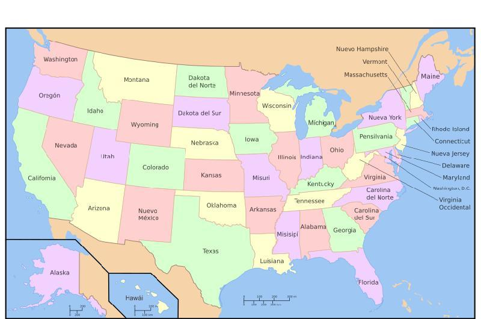

```{r setup, include=FALSE}
knitr::opts_chunk$set(echo = TRUE)
```

El presente trabajo tiene como objetivo ilustrar el uso de técnicas de análisis multivariado revisadas en la Maestría de Estadística PUCP. Para ello, se hizo uso de distintas bases de datos orientadas a la aplicación de dichas técnicas, las cuales se presentarán en las secciones correspondientes. Cada tipo de análisis tiene como base un problema de negocio o investigación, así como una base de datos la cual es útil para brindar solución al problema. Posteriormente, se analizan los resultados de dichas técnicas y se concluye sobre la misma.

Las técnicas multivariadas utilizadas en el presente informe son:

- Escalamiento Multidimensional
- Análisis de Conglomerados 

Ver a continuación el uso de cada técnica. 

# Escalamiento Multidimensional

## Introducción y Datos

El conjunto de datos corresponde a indicadores socioeconómicos y de fertilidad de las provincias francesas de Suiza. Dichos indicadores fueron compilados por Francine Van der Walle y publicados en el artículo \textit{Education and the Demographic Transition in Switzerland} en el año 1980. Dicho conjunto de datos está presente en la instalación base del programa R. El presente conjunto de datos contiene las siguientes variables:

- Fertility: Medida de fertilidad para cada provincia.
- Agriculture: Porcentaje de varones cuyo trabajo está relacionado a la agricultura.
- Examination: Porcentaje de personas con el mayor porcentaje en el examen del ejército.
- Education: Porcentaje de personas que hayan sido convocadas al ejercito con educación mayor a instrucción primaria.
- Catholic: Porcentaje de personas católicas.
- Infant.Mortality: Cantidad de decesos de niños menores a un año.

Los objetivos del presente estudio son:

- Identificar qué provincias están más próximas a otras.
- Identificar si existen provincias "parecidas" en base a su representación en dos dimensiones.

Con el propósito de ejecutar el análisis de los datos, realizamos la carga de librerías e importamos los datos. Posteriormente, realizamos un preprocesamiento de los datos (creación de la matriz de distancias). Ver código a continuación:

```{r}

library(smacof)
data(swiss)
dswiss <- dist(swiss,method = "euclidian",diag = T,upper = T)

m <- as.matrix(dswiss)
dist_swiss <- as.dist(m)
```

## Resultados

Con el propósito de identificar cuántas dimensiones son necesarias para hacer el escalamiento multidimensional, utilizaremos un gráfico que mide el stress por número de dimensiones. Aplicaremos la "técnica del codo" para identificar un número razonable. Ver gráfico a continuación:

```{r}
svec <- NULL
for (i in 1:dim(swiss)[2]) {
  svec[i] <- mds(delta=dist_swiss, ndim = i, type = "interval")$stress
}

plot(seq(1:dim(swiss)[2]),svec,type="overplotted", pch=16, ylab="Stress",xlab="Número de dimensiones")

```

Se observa en dicho gráfico que el número de dimensiones apropiado es el número 2, pues es el que reduce considerablemente el indicador de stress, mientras que dimensiones adicionales reducen el stress en menor cuantía.

A través de la función mds podemos realizar el escalamiento multidimensional de dos dimensiones. Ver código a continuación:

```{r}
fit.mds <- mds(delta = dist_swiss,ndim=2,type = "interval")
fit.mds
```

Se observa que el indicador de stress es de 0.05, por lo cual la bondad de ajuste a dos dimensiones es excelente de acuerdo a lo indicado en clase. A pesar de que dicho indicador indica que la representación es excelente, es bueno conocer qué provincias son las que contribuyen a este indicador de stress. Ver código a continuación:

```{r}
plot(fit.mds, plot.type = "stressplot")
```

Se observa lo siguiente:

- El 25% del stress se concentra en 3 provincias: Rive Droite (con 10% del total), Courtelary (8%) y Moutier (aproximadamente 7%).
- Las demás provincias tienen menor proporción del stress asociado.

Posteriormente, evaluaremos si la ordenación lograda, producto del escalamiento multidimensional, coincide con las disparidades originales. Para ello, hacemos uso del gráfico de Shepard. Ver gráfico a continuación:

```{r}
plot(fit.mds,plot.type="Shepard",plot.dim=c(1,2),sphere=TRUE,bubscale=0.1,col=1,
     label.conf=list(label=TRUE,pos=3,col=1,cex=0.8),
     shepard.x=NULL,identify=FALSE,
     type="p",pch=20,asp=1,col.hist=NULL)
```

En base a este gráfico, se observa lo siguiente:

- Se observa que las disimilaridades se mantienen cercanas a la línea negra del gráfico de Shepard. Esto quiere decir que la representación de dimensión 2 coincide de forma adecuada con las disparidades. 
- Se observa que existen, entre el rango de 20 a 60 en el eje vertical, ciertos valores alejados de los demás. Estos podrían deberse a las provincias mencionadas anteriormente.

En base a lo detallado anteriormente, se realiza la representación gráfica de las ciudades en dos dimensiones. Ver a continuación:

```{r}
plot(fit.mds,plot.type="confplot",plot.dim=c(1,2),sphere=TRUE,bubscale=0.1,col=1,
     label.conf=list(label=TRUE,pos=3,col=1,cex=0.8),
     shepard.x=NULL,identify=FALSE,
     type="p",pch=20,asp=1,col.hist=NULL)

```

## Discusión y conclusiones

En base a los resultados presentados, se concluye lo siguiente:

- Existen dos grandes grupos de provincias con atributos similares, los cuales componen aproximadamente el 97% de provincias francesas en Suiza. Esto quiere decir que podría existir dos tipos de comportamiento social en las provincias.
- Existen provincias que no pertenecen a ninguno de estos grupos, las cuales son: "V. De Geneve", "Rive Gauche", "Rive Droite" y "Moutier". Dos de estas ciudades son las que tienen mayor porcentaje del stress mencionado anteriormente (ver sección "Resultados").
- Es posible que esta separación en grupos implique que existen determinadas características comunes en la ciudad. Para ello, un paso a futuro de la presente investigación sería analizar las provincias e identificar si eixste algún patrón de comportamiento en cada sucdad.


# Análisis de Conglomerados

## Introducción y Datos

El conjunto de datos corresponde a la cantidad de arrestos por cada cien mil habitantes en cada uno de los 50 estados de Estados Unidos por el año 1973. Esta base de datos forma parte de las estadísticas que el gobierno de Estados Unidos recopila sobre cada uno de sus estados asociados, y aparece en el \textit{World Almanac and Book of Facts}, edición 1975. Dicho conjunto de datos está presente en la instalación base del programa R. El presente conjunto de datos contiene las siguientes variables:

- Murder: Cantidad de arrestos por asesinato por cada cien mil habitantes.
- Assault: Cantidad de arrestos por asalto por cada cien mil habitantes.
- UrbanPop: Porcentaje de población urbana.
- Rape: Cantidad de arrestos por violación por cada cien mil habitantes.

Los objetivos del presente estudio son:

- Identificar qué estados son parecidos a otras con el objetivo de elaborar políticas públicas de alto nivel para dichas estados.
- Identificar si dichas estados parecidos están cerca geográficamente.

Para ello, haremos uso del método k-medias para identificar la agrupación de estados.

Con el propósito de ejecutar el análisis de los datos, realizamos la carga de librerías e importamos los datos. Posteriormente, realizamos un preprocesamiento de los datos (estandarización). Ver código a continuación:

```{r}
data("USArrests")
USA_scale <- as.data.frame(scale(USArrests))
```

## Resultados

El método k-medias permite definir la cantidad de clusters a discreción del investigador, no obstante existen métodos a través del cual podemos definir una \textit{cantidad razonable} de clusters. Uno de estos métodos se basa en la suma de cuadrados intraclusters, en dónde se visualiza la suma de cuadrados intraclusters en la medida que se aumente uno. Este método es una inspección visual cuyo criterio de decisión es que el aumento de un cluster adicional no disminuya la suma de cuadrados intracluster de forma significativa. Ver código a continuación:

```{r}
mydata <- USA_scale
wss <- (nrow(mydata)-1)*sum(apply(mydata,2,var))
for (i in 2:15) wss[i] <- sum(kmeans(mydata,centers=i)$withinss)

plot(1:15, wss, type="b", xlab="Numero de cluster",
     ylab="Dentro de los grupos suma de cuadrados",
     main="Evaluar el numero optimo de conglomerados con el metodo del codo",
     pch=20, cex=2)
```

Bajo este método, podemos observar que, del quinto cluster hacia adelante, la suma de cuadrados intra cluster no disminuye significativamente. Por lo tanto, definimos como cantidad de clusters óptimos el número 4.

Dado que el método de K-medias tiene una inicialización aleatoria, definimos una semilla para obtener resultados reproducibles.

```{r}
set.seed(350)
USA_means <- kmeans(USA_scale,centers = 4,nstart = 100)
USA_means
```

De acuerdo a la salida de R, se observa lo siguiente:

- El cluster 1 y 2 contienen la menor suma de cuadrados por cluster, mientras que los clusters 3 y 4 son contienen mayor variabilidad.
- Observando las medias de cada grupo, se observa que:
  - El cluster 1 está más relacionado a una mayor tasa de arrestos por asesinato y asalto.
  - El cluster 3 tiene la menor tasa de arrestos en general por los tipos de crímenes.
  - El cluster 4 tiene la mayor tasa de arrestos por crímenes relacionados a asalto y violación.
  - El cluster 2 está relacionado a estados con mayor concentración urbana y menor tasa de arrestos.
  
Posteriormente, identificaremos las estados que pertenecen a cada cluster. Ver código a continuación:

```{r}
USA_cluster <- as.data.frame(USA_means$cluster)
USA_cluster$ciudad <- rownames(USA_cluster)
USA_cluster <- USA_cluster[order(USA_cluster$`USA_means$cluster`),]
USA_cluster
```

Con el propósito de continuar con el análisis, se adjunta una imagen de los estados de Estados Unidos.

```{r}

```

En base a ello se observa:

- En relación al cluster 1:
  - Se observa que los estados dentro de dicho cluster están próximos geográficamente (Alabama, Arkansas, Georgia, Louisiana, Mississippi y Carolina del Sur y del Norte).
- En relación al cluster 2:
  - Se observa que existe ciertos estados que están próximos geográficamente (Rhode Island, New Jersey y Massachusetts).
- No se identifica una proximidad geográfica fuerte entre los otros dos clusters.
  

## Discusión y conclusiones
En base a lo anterior, podemos concluir que:

- Dentro de los clusters identificados, existen clusters cuyo componente geográfico es notorio. Es decir, dichos estados tienen tasas de arrestos parecidas y están cerca geográficamente. Ello podría hacernos suponer que existe dichos estados podrían estar integrados socialmente (a nivel de movilidad, cultura, valores u otros).
- Aquellos clusters que contienen el componente geográfico son los que menor suma de cuadrados intraclusters, lo cual reforzaría el punto anterior. Ello podría indicar que el componente geográfico o social es un determinante en estados aledaños.
- Los dos primeros clusters se podrían beneficiar de políticas públicas integradas para dichos estados, pues son más parecidas que los otros dos clusters. Los últimos clusters podrían tener políticas públicas específicas, pues existe mucha variación (en términos relativos) entre sus integrantes.